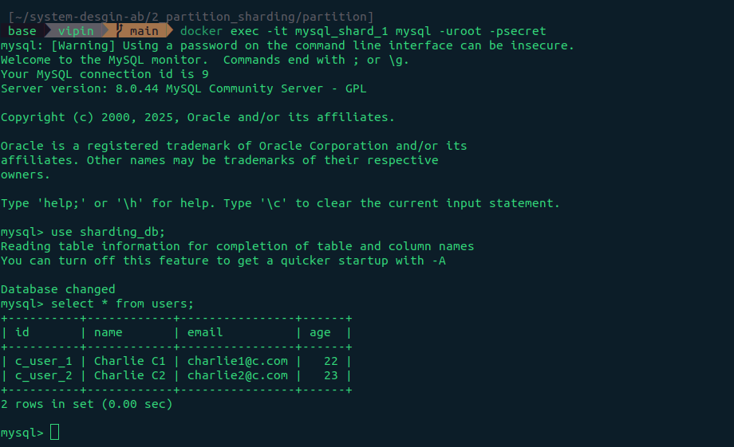
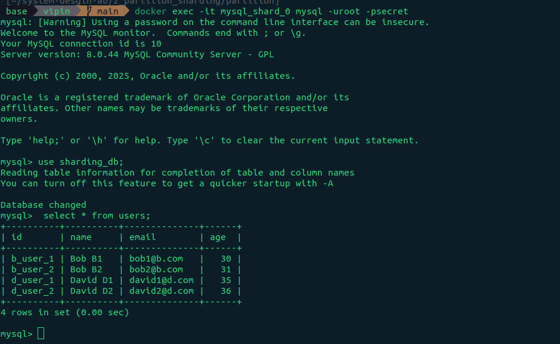

# Go + MySQL Sharding Proof of Concept

This project demonstrates **Application-Level Database Sharding** using **Go** and **MySQL**. It simulates a multi-tenant architecture where data is distributed across different database instances (shards) based on a client identifier.

## 🚀 Overview

The application acts as a routing layer. Instead of a single monolithic database, the system runs multiple MySQL instances (Shards 0, 1, and 2).

When a request comes in:

1. The API reads the `Client-X-Id` header.
2. A sharding algorithm (hashing) determines which MySQL container holds that client's data.
3. The application connects to the specific shard to perform Read/Write operations.

### Architecture

- **Language:** Go (Golang)
- **Database:** MySQL (3 separate Docker containers)
- **Routing Strategy:** Header-based sharding (`Client-X-Id`)
- **Infrastructure:** Docker Compose

---

## 🛠️ Prerequisites

- Docker & Docker Compose
- Go 1.22+ (optional, if running locally without Docker)
- curl (for testing)

---

## 🏁 Quick Start

1. **Start the environment**
   Spin up the Go application and the MySQL shards.
   ```docker
   docker compose up -d
   ```
2. Verify containers are running

   ```docker
   docker ps
   ```

You should see mysql_shard_0, mysql_shard_1, mysql_shard_2, and the app container.

## 🧪 Testing & Usage APIs

#### The following curl commands simulate different clients creating and retrieving users. The response includes the shard ID, confirming where the data was stored.

### 1. Client A (Routes to Shard 2)

Create Users:

```bash
curl -X POST http://localhost:8080/users \
 -H "Content-Type: application/json" \
 -H "Client-X-Id: client_A" \
 -d '{"id": "a_user_1", "name": "Alice A1", "email": "alice1@a.com", "age": 25}'
```

`output`:

```json
{
  "data": {
    "shard": 2,
    "data": [
      {
        "id": "a_user_1",
        "name": "Alice A1",
        "email": "alice1@a.com",
        "age": 25
      }
    ]
  },
  "success": true
}
```

```bash
curl -X POST http://localhost:8080/users \
 -H "Content-Type: application/json" \
 -H "Client-X-Id: client_A" \
 -d '{"id": "a_user_2", "name": "Alice A2", "email": "alice2@a.com", "age": 26}'
```

`output`:

```json
{
  "data": {
    "shard": 2,
    "data": [
      {
        "id": "a_user_2",
        "name": "Alice A2",
        "email": "alice2@a.com",
        "age": 26
      }
    ]
  },
  "success": true
}
```

#### Verify in Database (Shard 2):

```docker
docker exec -it mysql_shard_2 mysql -uroot -psecret -e "use sharding_db; select * from users;"
```


### 2. Client B (Routes to Shard 0)

Create Users:

```bash
curl -X POST http://localhost:8080/users \
 -H "Content-Type: application/json" \
 -H "Client-X-Id: client_B" \
 -d '{"id": "b_user_1", "name": "Bob B1", "email": "bob1@b.com", "age": 30}'
```

`output`:

```json
{
  "data": {
    "shard": 0,
    "data": [
      { "id": "b_user_1", "name": "Bob B1", "email": "bob1@b.com", "age": 30 }
    ]
  },
  "success": true
}
```

```bash
curl -X POST http://localhost:8080/users \
 -H "Content-Type: application/json" \
 -H "Client-X-Id: client_B" \
 -d '{"id": "b_user_2", "name": "Bob B2", "email": "bob2@b.com", "age": 31}'
```

`output`:

```json
{
  "data": {
    "shard": 0,
    "data": [
      { "id": "b_user_2", "name": "Bob B2", "email": "bob2@b.com", "age": 31 }
    ]
  },
  "success": true
}
```

#### Verify in Database (Shard 0):

```docker
docker exec -it mysql_shard_0 mysql -uroot -psecret -e "use sharding_db; select * from users;"
```


### 3. Client C (Routes to Shard 1)

Create Users:

```bash
curl -X POST http://localhost:8080/users \
 -H "Content-Type: application/json" \
 -H "Client-X-Id: client_C" \
 -d '{"id": "c_user_1", "name": "Charlie C1", "email": "charlie1@c.com", "age": 22}'
```

`output`:

```json
{
  "data": {
    "shard": 1,
    "data": [
      {
        "id": "c_user_1",
        "name": "Charlie C1",
        "email": "charlie1@c.com",
        "age": 22
      }
    ]
  },
  "success": true
}
```

```bash
curl -X POST http://localhost:8080/users \
 -H "Content-Type: application/json" \
 -H "Client-X-Id: client_C" \
 -d '{"id": "c_user_2", "name": "Charlie C2", "email": "charlie2@c.com", "age": 23}'
```

`output`:

```json
{
  "data": {
    "shard": 1,
    "data": [
      {
        "id": "c_user_2",
        "name": "Charlie C2",
        "email": "charlie2@c.com",
        "age": 23
      }
    ]
  },
  "success": true
}
```

#### Verify in Database (Shard 1):

```docker
docker exec -it mysql_shard_1 mysql -uroot -psecret -e "use sharding_db; select * from users;"
```



### 4. Client D (Routes to Shard 0)

Note: Depending on the hashing algorithm, different clients may map to the same shard. Here, Client D maps to Shard 0, co-existing with Client B.

Create Users:

```bash
curl -X POST http://localhost:8080/users \
 -H "Content-Type: application/json" \
 -H "Client-X-Id: client_D" \
 -d '{"id": "d_user_1", "name": "David D1", "email": "david1@d.com", "age": 35}'
```

`output`:

```json
{
  "data": {
    "shard": 0,
    "data": [
      {
        "id": "d_user_1",
        "name": "David D1",
        "email": "david1@d.com",
        "age": 35
      }
    ]
  },
  "success": true
}
```

```bash
curl -X POST http://localhost:8080/users \
 -H "Content-Type: application/json" \
 -H "Client-X-Id: client_D" \
 -d '{"id": "d_user_2", "name": "David D2", "email": "david2@d.com", "age": 36}'
```

`output`:

```json
{
  "data": {
    "shard": 0,
    "data": [
      {
        "id": "d_user_2",
        "name": "David D2",
        "email": "david2@d.com",
        "age": 36
      }
    ]
  },
  "success": true
}
```

#### Verify in Database (Shard 0):

```docker
docker exec -it mysql_shard_0 mysql -uroot -psecret -e "use sharding_db; select * from users;"
```



## 🔍 Retrieval APIs (Read Operations)

Reading data also requires the Client-X-Id header so the application knows which shard to query.

#### Get Client A Data (Shard 2):

```bash
curl -X GET http://localhost:8080/users -H "Client-X-Id: client_A"
```

`output`:

```json
{
  "data": {
    "shard": 2,
    "data": [
      {
        "id": "a_user_1",
        "name": "Alice A1",
        "email": "alice1@a.com",
        "age": 25
      },
      {
        "id": "a_user_2",
        "name": "Alice A2",
        "email": "alice2@a.com",
        "age": 26
      }
    ]
  },
  "success": true
}
```

#### Get Client B Data (Shard 0): Note: This will fetch Client B's data. If isolation is not enforced at the query level, it might also show Client D's data since they share a shard.

```bash
curl -X GET http://localhost:8080/users -H "Client-X-Id: client_B"
```

`output`:

```json
{
  "data": {
    "shard": 0,
    "data": [
      { "id": "b_user_1", "name": "Bob B1", "email": "bob1@b.com", "age": 30 },
      { "id": "b_user_2", "name": "Bob B2", "email": "bob2@b.com", "age": 31 },
      {
        "id": "d_user_1",
        "name": "David D1",
        "email": "david1@d.com",
        "age": 35
      },
      {
        "id": "d_user_2",
        "name": "David D2",
        "email": "david2@d.com",
        "age": 36
      }
    ]
  },
  "success": true
}
```

#### Get Client C Data (Shard 1):

```bash
curl -X GET http://localhost:8080/users -H "Client-X-Id: client_C"
```

`output`:

```json
{
  "data": {
    "shard": 1,
    "data": [
      {
        "id": "c_user_1",
        "name": "Charlie C1",
        "email": "charlie1@c.com",
        "age": 22
      },
      {
        "id": "c_user_2",
        "name": "Charlie C2",
        "email": "charlie2@c.com",
        "age": 23
      }
    ]
  },
  "success": true
}
```


## 🧹 Cleanup

To stop the containers and remove the networks:

```docker
docker compose down
```
