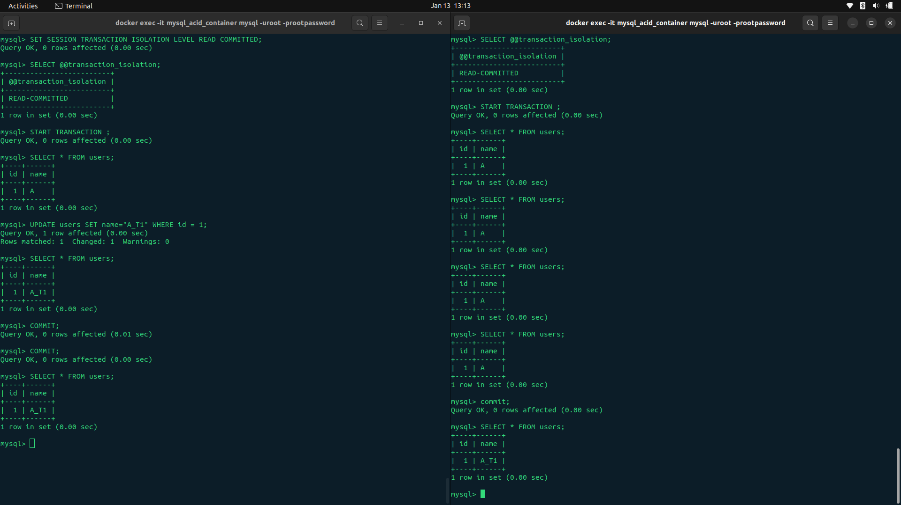
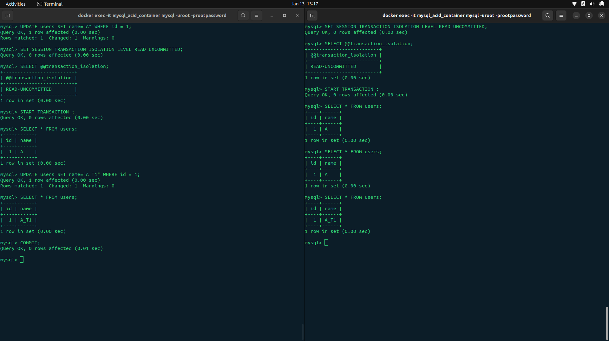
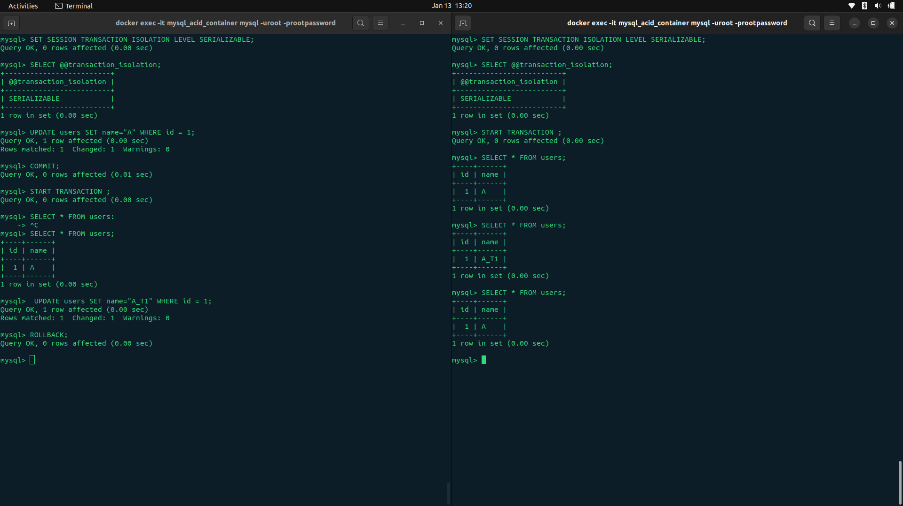

# SQL Transaction Isolation Levels Explained

Understanding isolation levels is crucial for building reliable database applications. This guide explains how different isolation levels prevent concurrency problems and when to use each one.

---

## What Are Isolation Levels?

**Isolation** is the "I" in ACID properties. It determines how transaction integrity is visible to other concurrent transactions. In simpler terms: **when multiple transactions run at the same time, how much should they know about each other's changes?**

Think of it like working on a shared document:

- Should you see others typing in real-time? (READ UNCOMMITTED)
- Should you only see changes after they hit "Save"? (READ COMMITTED)
- Should your view of the document freeze when you open it? (REPEATABLE READ)
- Should only one person edit at a time? (SERIALIZABLE)

---

## The Four Isolation Levels

| Isolation Level      | Description                                                                                                 | Prevents                                | Performance |
| -------------------- | ----------------------------------------------------------------------------------------------------------- | --------------------------------------- | ----------- |
| **READ UNCOMMITTED** | One transaction can see uncommitted changes from another transaction (dirty reads allowed)                  | Nothing                                 | ⚡ Fastest  |
| **READ COMMITTED**   | A transaction sees only changes that have been committed by other transactions                              | Dirty Reads                             | 🚀 Fast     |
| **REPEATABLE READ**  | If you read a row once, you're guaranteed to see the same data if you read it again in the same transaction | Dirty Reads, Non-repeatable Reads       | ⚙️ Moderate |
| **SERIALIZABLE**     | Transactions are executed as if they were one after another (fully isolated)                                | All anomalies (including Phantom Reads) | 🐌 Slowest  |

**MySQL Default:** `REPEATABLE READ`  
**PostgreSQL Default:** `READ COMMITTED`

---

## Common Concurrency Problems

### 1. Dirty Read

Reading data that another transaction hasn't committed yet (and might roll back).

```sql
-- Transaction A
START TRANSACTION;
UPDATE accounts SET balance = 5000 WHERE id = 1;
-- NOT committed yet!

-- Transaction B (at READ UNCOMMITTED)
SELECT balance FROM accounts WHERE id = 1;  -- Sees 5000

-- Transaction A
ROLLBACK;  -- Oops! Transaction B saw data that never existed!
```

**Prevented by:** READ COMMITTED and higher

---

### 2. Non-Repeatable Read

Reading the same row twice in one transaction but getting different values.

```sql
-- Transaction A
START TRANSACTION;
SELECT balance FROM accounts WHERE id = 1;  -- Sees 1000

-- Transaction B
UPDATE accounts SET balance = 2000 WHERE id = 1;
COMMIT;

-- Transaction A
SELECT balance FROM accounts WHERE id = 1;  -- Now sees 2000!
-- Same transaction, different results 🤔
```

**Prevented by:** REPEATABLE READ and higher

---

### 3. Phantom Read

A query returns different sets of rows when executed twice in the same transaction.

```sql
-- Transaction A
START TRANSACTION;
SELECT * FROM accounts WHERE balance > 1000;  -- Finds 5 rows

-- Transaction B
INSERT INTO accounts (balance) VALUES (1500);
COMMIT;

-- Transaction A
SELECT * FROM accounts WHERE balance > 1000;  -- Now finds 6 rows!
-- A "phantom" row appeared 👻
```

**Prevented by:** SERIALIZABLE only

---

## Setting Isolation Levels

### Session-Level (Affects all subsequent transactions)

```sql
-- Set for current session
SET SESSION TRANSACTION ISOLATION LEVEL READ COMMITTED;

-- Verify current level
SELECT @@transaction_isolation;
```

### Transaction-Level (Affects only the next transaction)

```sql
SET TRANSACTION ISOLATION LEVEL REPEATABLE READ;
START TRANSACTION;
-- Your queries here
COMMIT;
```

### Global-Level (Affects all new connections)

```sql
-- Requires appropriate privileges
SET GLOBAL TRANSACTION ISOLATION LEVEL READ COMMITTED;
```

---

## Why READ COMMITTED Didn't Behave As Expected

You might expect that with `READ COMMITTED`, you'd immediately see changes from other transactions as soon as they commit. However, there are important nuances:

### The "Read View" or "Snapshot" Rule

Many database engines (including MySQL's InnoDB) create a **consistent read view** (or snapshot) at a specific point in your transaction. This behavior varies by isolation level:

```sql
-- Transaction A (READ COMMITTED)
START TRANSACTION;

SELECT * FROM users WHERE id = 1;  -- Creates a read view HERE
-- Returns: name = "John"

-- Transaction B (in another session)
UPDATE users SET name = "Jane" WHERE id = 1;
COMMIT;  -- Transaction B commits

-- Back to Transaction A
SELECT * FROM users WHERE id = 1;
-- With READ COMMITTED: Should see "Jane" (new read view)
-- But in some cases might still see "John"
```

### Why This Happens

**1. Statement-Level vs Transaction-Level Snapshots:**

- **READ COMMITTED**: In most databases, each statement gets a fresh snapshot, so you see the latest committed data
- **REPEATABLE READ**: The snapshot is created at the start of the transaction and remains consistent throughout

**2. InnoDB's MVCC (Multi-Version Concurrency Control):**
MySQL's InnoDB storage engine uses MVCC, which maintains multiple versions of rows. The read view determines which version you see:

```sql
-- At REPEATABLE READ
START TRANSACTION;
SELECT balance FROM accounts WHERE id = 1;  -- Snapshot created
-- You're now "locked" to this view until COMMIT/ROLLBACK

-- At READ COMMITTED
START TRANSACTION;
SELECT balance FROM accounts WHERE id = 1;  -- Snapshot 1
-- Another transaction commits changes
SELECT balance FROM accounts WHERE id = 1;  -- Snapshot 2 (sees new data)
```

**3. Configuration and Storage Engine Differences:**

- Different storage engines behave differently
- Configuration parameters can affect snapshot behavior
- Some ORMs and connection poolers may have their own transaction management

---

## Choosing the Right Isolation Level

| Use Case                      | Recommended Level               | Why                                            |
| ----------------------------- | ------------------------------- | ---------------------------------------------- |
| **Banking transactions**      | SERIALIZABLE or REPEATABLE READ | Prevent lost updates, ensure consistency       |
| **E-commerce checkout**       | REPEATABLE READ                 | Prevent inventory overselling                  |
| **Read-heavy reporting**      | READ COMMITTED                  | Better performance, dirty reads prevented      |
| **Real-time dashboards**      | READ COMMITTED                  | See latest data quickly                        |
| **Analytics queries**         | READ UNCOMMITTED                | Maximum speed, slight inconsistency acceptable |
| **Audit logs, critical data** | SERIALIZABLE                    | Maximum consistency required                   |

---

## Practical Examples

### Example 1: Preventing Double-Booking (REPEATABLE READ)

```sql
START TRANSACTION;

-- Check if seat is available
SELECT status FROM seats WHERE id = 42;  -- Returns 'available'

-- Another user tries to book the same seat (blocked)

-- Book the seat
UPDATE seats SET status = 'booked', user_id = 123 WHERE id = 42;

COMMIT;
```

### Example 2: Real-Time Inventory (READ COMMITTED)

```sql
SET TRANSACTION ISOLATION LEVEL READ COMMITTED;
START TRANSACTION;

-- Check current inventory (sees latest committed values)
SELECT quantity FROM products WHERE id = 5;

-- Reduce inventory
UPDATE products SET quantity = quantity - 1 WHERE id = 5;

COMMIT;
```

### Example 3: Financial Report (SERIALIZABLE)

```sql
SET TRANSACTION ISOLATION LEVEL SERIALIZABLE;
START TRANSACTION;

-- Generate end-of-day report
SELECT SUM(amount) FROM transactions WHERE date = CURRENT_DATE;
SELECT COUNT(*) FROM transactions WHERE date = CURRENT_DATE;

-- No other transactions can modify this data until we're done
COMMIT;
```

---

## Performance vs Consistency Trade-off

```
READ UNCOMMITTED  ←——————————————————————→  SERIALIZABLE
     ⚡ Fast                                    🔒 Safe
     ⚠️ Risky                                   🐌 Slow
```

**Rule of Thumb:**

- Start with your database's default (usually READ COMMITTED or REPEATABLE READ)
- Only increase isolation if you encounter specific concurrency problems
- Only decrease isolation if performance is critical and you understand the risks

---

## Deadlock Prevention Tips

Higher isolation levels increase the chance of deadlocks. To minimize them:

1. **Keep transactions short** - Don't include user interaction
2. **Access tables in the same order** - Reduces circular dependencies
3. **Use appropriate indexes** - Reduces lock duration
4. **Consider optimistic locking** - For certain use cases
5. **Implement retry logic** - Handle deadlocks gracefully

```sql
-- Deadlock example
-- Transaction A: Locks row 1, then tries to lock row 2
-- Transaction B: Locks row 2, then tries to lock row 1
-- Result: Deadlock! One transaction will be killed.
```

---

## Testing Isolation Levels

Try this experiment with two terminal windows:

**Terminal 1:**

```sql
SET SESSION TRANSACTION ISOLATION LEVEL READ COMMITTED;
START TRANSACTION;
SELECT * FROM users WHERE id = 1;
-- Leave this open, don't commit yet
```

**Terminal 2:**

```sql
UPDATE users SET name = 'Updated' WHERE id = 1;
COMMIT;
```

**Back to Terminal 1:**

```sql
SELECT * FROM users WHERE id = 1;  -- What do you see?
COMMIT;
```

Repeat with different isolation levels to see the behavior change!

---

## Summary

- **Isolation levels control how transactions interact with each other**
- **Higher isolation = more consistency but less performance**
- **Lower isolation = better performance but potential anomalies**
- **MySQL defaults to REPEATABLE READ, which prevents most common issues**
- **Always test your specific use case under concurrent load**

Understanding isolation levels helps you build applications that are both **performant** and **correct** under concurrent access.

---

## Further Reading

- [MySQL InnoDB Transaction Isolation](https://dev.mysql.com/doc/refman/8.0/en/innodb-transaction-isolation-levels.html)
- [PostgreSQL Transaction Isolation](https://www.postgresql.org/docs/current/transaction-iso.html)
- [MVCC Explained](https://en.wikipedia.org/wiki/Multiversion_concurrency_control)

## IMAGES








