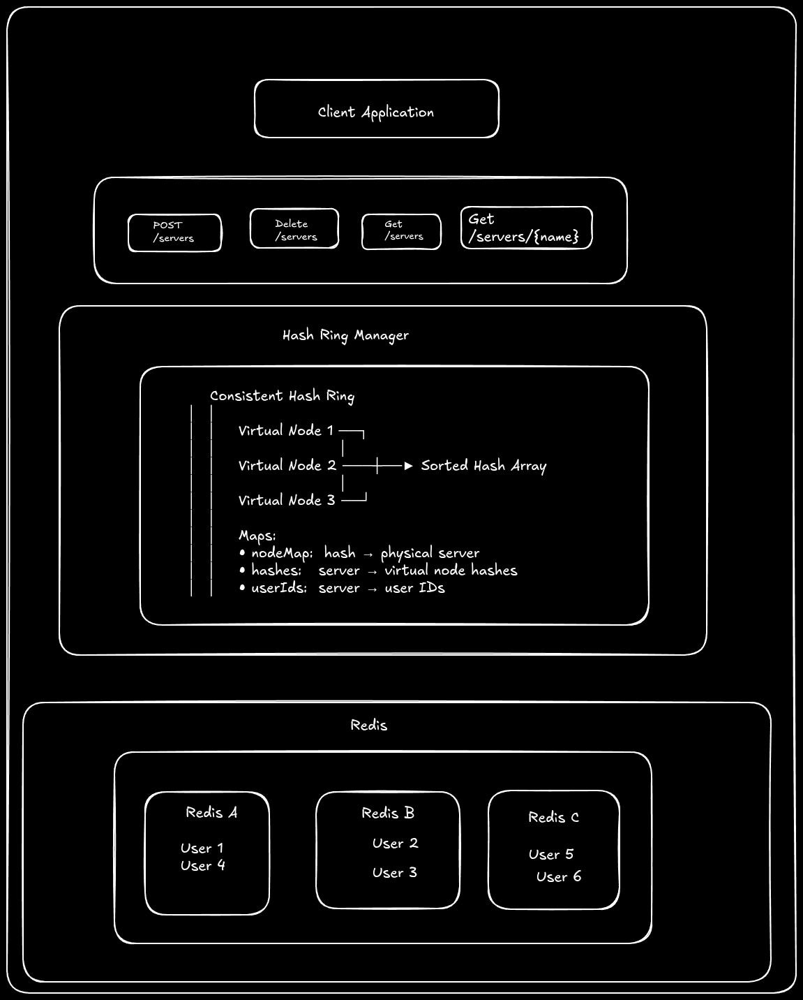

# Consistent Hashing

#### In distributed systems, consistent hashing is a method used to determine which node (server) "owns" or is responsible for a specific piece of data.

#### Unlike traditional hashing, where a change in the number of servers forces almost every key to be remapped, consistent hashing ensures that only a small fraction of keys are moved when nodes join or leave.

## How Ownership is Established

The system uses a conceptual Hash Ring, which represents the entire range of possible hash values (for example, from 3$0$ to 4$2^{32}-1$).5

1. `Mapping Nodes`: Every server is hashed (using its IP or ID) and placed at a specific point on the ring.

2. `Mapping Data`: Every piece of data (key) is hashed using the same function and placed on the same ring.

3. `Determining Ownership`: To find the "owner," you start at the data’s hash position and move clockwise around the ring. The first server you encounter is the one that "owns" that data.

## Key Characteristics of Ownership

- `Sticky Ownership`: Because the hash of a key doesn't change, it will always map to the same server as long as the cluster remains stable.

- `Minimal Disruption`: If a server (Node B) is removed, only the data it owned is transferred to its immediate clockwise neighbor (Node C). The rest of the cluster's ownership remains untouched.

- `Virtual Nodes`: To prevent one server from owning a much larger "slice" of the ring than others, systems often use Virtual Nodes. Each physical server is hashed multiple times to appear at several different locations on the ring, ensuring a more even distribution of ownership.

## Common Use Cases

- `Distributed Caching (e.g., Memcached)`: Ensures that when a cache server goes down, only the keys on that server are lost, preventing a "cache stampede" on the database.

- `Distributed Databases (e.g., Amazon DynamoDB, Apache Cassandra)`: Used to partition data across hundreds of nodes while maintaining high availability.

- `Load Balancing`: Directing specific user requests to the same backend server to maintain session state.

# Go + Consistent Hashing

This project implements a consistent hashing ring that distributes data across multiple servers. When servers are added or removed, the system automatically rebalances the data with minimal disruption, making it ideal for distributed caching, load balancing, and database sharding scenarios.

## Architecture



<br/>


<br/>

## Features

1. `Consistent Hashing Ring`: Minimizes data redistribution when servers are added or removed
2. `Thread-Safe Operations`: Uses mutex locks for concurrent access safety 3.` Singleton Pattern`: Single hash ring instance across the application
3. ` Redis Integration`: Persistent storage for user data
4. `Automatic Rebalancing`: When a server is removed, data is automatically migrated to the next server
5. `RESTful API`: Clean HTTP interface for all operations
6. `Virtual Nodes`: Supports virtual nodes for better load distribution (extendable)

## How It Works

### Hash Ring Structure

The HashRing maintains several key data structures:

```go
type HashRing struct {
    nodes   []int            // Sorted array of virtual node hashes
    nodeMap map[int]string   // Hash → Physical server name mapping
    hashes  map[string][]int // Server name → Virtual node hashes
    userIds map[string][]string // Server name → User IDs on that server
}
```

### Adding a Server

When you add a server:

- Hash the server name to get a position on the ring
- Insert the hash into the sorted nodes array
- Create mappings in nodeMap and hashes
- The ring automatically sorts to maintain order

```go
AddNode("server-1") → Hash(server-1) = 12345
                   → Insert 12345 into sorted ring
                   → nodeMap[12345] = "server-1"
```

### Locating Data Owner

When storing or retrieving a user:

- Hash the user ID to get a position on the ring
- Use binary search to find the first server hash ≥ user hash
- If at the end of the ring, wrap around to the first server (circular)

```go
GetOwner("user-42") → Hash(user-42) = 8000
                    → Binary search finds first hash ≥ 8000
                    → Returns corresponding server name
```

### 4. Removing a Server

When removing a server:

- Get all users stored on that server
- Remove the server from the hash ring
- For each user, find the new owner (next server on the ring)
- Migrate data from old server to new server in Redis
- Clean up old data

```go
DeleteNode("server-1"):
  1. Get userIds["server-1"] = ["user-1", "user-2"]
  2. Remove server-1 from ring
  3. For "user-1":
     - Find new owner: "server-2"
     - Read from Redis: "server-1:hash"
     - Write to Redis: "server-2:hash"
     - Delete from Redis: "server-1:hash"
```

### 5. Data Storage Pattern

Data is stored in Redis with a composite key:

```go
Key Format: "serverName:userHash"
Value: JSON serialized User object

Example:
Key: "server-1:8765"
Value: {"id":"user-42","name":"Alice","email":"alice@example.com"}
```

## API Endpoints

### Server Management

#### List All Servers

```
GET /servers
```

#### Add Server

```
POST /servers
Content-Type: application/json

{
  "name": "server-1"
}
```

#### Get Server Info

```
GET /servers/{name}
```

#### Remove Server

```
DELETE /servers/{name}
```

### User Management

#### Add User

```
POST /users
Content-Type: application/json

{
  "id": "user-1",
  "name": "John Doe",
  "email": "john@example.com"
}
```

#### Get User

```
GET /users/{id}
```

You can run the application and use swagger for APIs: http://localhost:8080/docs/index.html#/

## Usages

### Creating 3 servers: A-Server, B-Server, C-Server

`Run in Terminal`

```bash
for server in "A-Server" "B-Server" "C-Server"; do
    echo "Registering $server..."
    curl -X 'POST' \
      'http://localhost:8080/servers' \
      -H 'Content-Type: application/json' \
      -d "{\"name\": \"$server\"}"
    echo -e "\n-------------------"
done
```

### Creating 8 users:

`Run in Terminal`

```bash
users='[
  {"id": "U001", "name": "Alice Hamilton", "email": "alice@hashring.com", "age": 28},
  {"id": "U002", "name": "Bob Richards", "email": "bob@dist-systems.io", "age": 34},
  {"id": "U003", "name": "Charlie Day", "email": "charlie@node-cluster.net", "age": 22},
  {"id": "U004", "name": "Diana Prince", "email": "diana@themyscira.gov", "age": 30},
  {"id": "U005", "name": "Evan Wright", "email": "evan.w@sharding.biz", "age": 45},
  {"id": "U006", "name": "Fiona Gallagher", "email": "fiona@southside.com", "age": 26},
  {"id": "U007", "name": "George Miller", "email": "george@madmax.org", "age": 52},
  {"id": "U008", "name": "Hannah Abbott", "email": "hannah@hufflepuff.edu", "age": 19}
]'

# Loop through each user using jq to parse the JSON
echo "$users" | jq -c '.[]' | while read -r user; do
    echo "Adding user: $(echo $user | jq -r .name)..."
    curl -X 'POST' \
      'http://localhost:8080/users' \
      -H 'Content-Type: application/json' \
      -d "$user"
    echo -e "\n-------------------"
done

```

### Check Server Info

```bash
curl http://localhost:8080/servers/A-Server
```

### Remove a Server (Data Auto-Migrates)

```
curl -X DELETE http://localhost:8080/servers/C-Server
```
