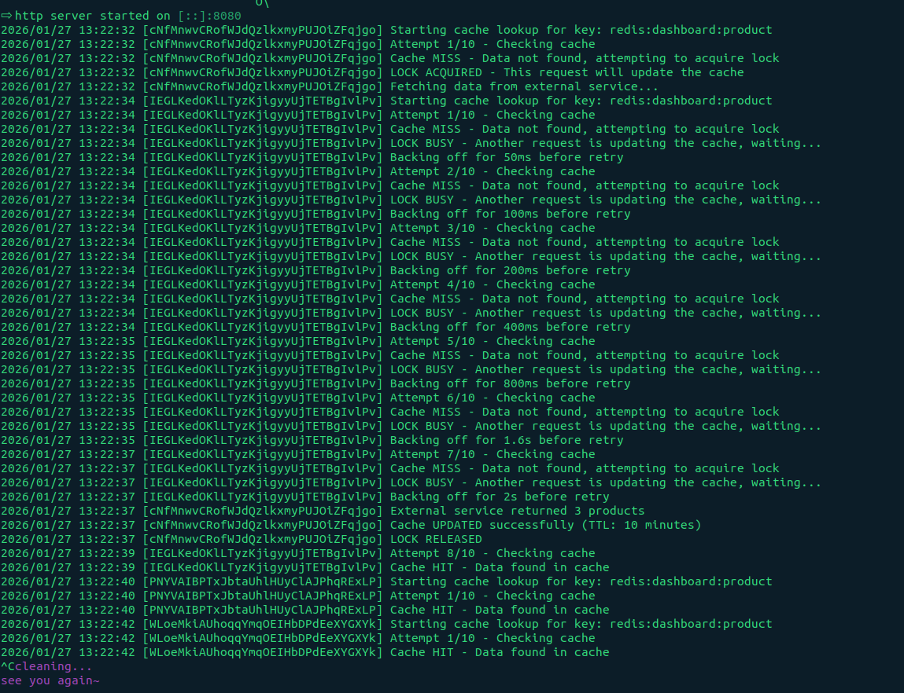

# Cache Locking (Distributed Locking)

Cache locking (often implemented via Redis using SETNX or Redlock) ensures that only one worker can update or "fill" a cache key at a time.

- **The Problem it Solves**: `Cache Stampede` (Thundering Herd). When a hot cache key expires, 1,000 concurrent requests might all see the "miss," and all 1,000 will try to query the database and update the cache simultaneously.

- **How it Works**:
  1. The first request to see a "miss" acquires a lock ($Lock_{key}$).

  2. All subsequent requests wait or return a stale value while the lock is held.
  3. The first request updates the cache and releases the lock.

- **Best For**:
  1. `Data Integrity`: Preventing race conditions during write-heavy operations.
  2. `Protecting Downstream DBs`: Ensuring heavy queries are only executed once.

---

<br/>
<br/>
<br/>

# Redis Caching with Distributed Locking

A robust Go implementation of cache-aside pattern with distributed locking, exponential backoff, and proper error handling for high-concurrency scenarios.

## Overview

This package provides a Redis-based caching solution that prevents cache stampede (thundering herd) problems using distributed locks. When multiple requests attempt to fetch expired or missing cache data simultaneously, only one request updates the cache while others wait and retry.

## Features

- ✅ **Cache-Aside Pattern**: Check cache first, update on miss
- ✅ **Distributed Locking**: Prevents multiple simultaneous cache updates
- ✅ **Exponential Backoff**: Smart retry mechanism with configurable delays
- ✅ **Context-Aware**: Respects context cancellation and timeouts
- ✅ **Comprehensive Logging**: Track cache hits, misses, lock acquisitions, and conflicts
- ✅ **Type-Safe JSON Serialization**: Generic helpers for marshaling/unmarshaling

## How It Works

```
Request 1 ──┐
Request 2 ──┼──> Cache Miss ──> Try Lock ──┬──> Acquired ──> Update Cache ──> Return Data
Request 3 ──┘                               │
                                            └──> Failed ──> Wait & Retry ──> Cache Hit ──> Return Data
```

### Flow Diagram

1. **Cache Check**: First, attempt to retrieve data from Redis
2. **Lock Acquisition**: On cache miss, try to acquire a distributed lock
3. **Leader Election**:
   - ✅ **Lock Acquired**: This request becomes the "leader" and updates the cache
   - ❌ **Lock Busy**: Other requests wait with exponential backoff
4. **Retry Logic**: Waiting requests retry fetching from cache (now updated by leader)
5. **Timeout Protection**: After max retries, return timeout error

## Configuration

### Tunable Parameters

| Parameter    | Default | Description                      |
| ------------ | ------- | -------------------------------- |
| `maxRetries` | 10      | Maximum number of retry attempts |
| `baseDelay`  | 50ms    | Initial backoff delay            |
| `maxDelay`   | 2s      | Maximum backoff delay            |
| `lockTTL`    | 10s     | How long the lock is held        |
| `cacheTTL`   | 10min   | How long cached data persists    |

### Adjusting Configuration

```go
// In GetOrUpdateProductsForDashboardWithBackoff function
maxRetries := 10                        // Increase for more patience
baseDelay := 50 * time.Millisecond      // Lower for faster retries
maxDelay := 2 * time.Second             // Higher for less aggressive polling
```

## Logging

The package provides detailed logging for monitoring and debugging:

### Log Levels

```
2026/01/27 13:22:32 [cNfMnwvCRofWJdQzlkxmyPUJOiZFqjgo] Starting cache lookup for key: redis:dashboard:product
2026/01/27 13:22:32 [cNfMnwvCRofWJdQzlkxmyPUJOiZFqjgo] Attempt 1/10 - Checking cache
2026/01/27 13:22:32 [cNfMnwvCRofWJdQzlkxmyPUJOiZFqjgo] Cache MISS - Data not found, attempting to acquire lock
2026/01/27 13:22:32 [cNfMnwvCRofWJdQzlkxmyPUJOiZFqjgo] LOCK ACQUIRED - This request will update the cache
2026/01/27 13:22:32 [cNfMnwvCRofWJdQzlkxmyPUJOiZFqjgo] Fetching data from external service...
2026/01/27 13:22:37 [cNfMnwvCRofWJdQzlkxmyPUJOiZFqjgo] External service returned 3 products
2026/01/27 13:22:37 [cNfMnwvCRofWJdQzlkxmyPUJOiZFqjgo] Cache UPDATED successfully (TTL: 10 minutes)
2026/01/27 13:22:37 [cNfMnwvCRofWJdQzlkxmyPUJOiZFqjgo] LOCK RELEASED

```

### Concurrent Request Example

```
2026/01/27 13:22:32 [cNfMnwvCRofWJdQzlkxmyPUJOiZFqjgo] Starting cache lookup for key: redis:dashboard:product
2026/01/27 13:22:32 [cNfMnwvCRofWJdQzlkxmyPUJOiZFqjgo] Attempt 1/10 - Checking cache
2026/01/27 13:22:32 [cNfMnwvCRofWJdQzlkxmyPUJOiZFqjgo] Cache MISS - Data not found, attempting to acquire lock
2026/01/27 13:22:32 [cNfMnwvCRofWJdQzlkxmyPUJOiZFqjgo] LOCK ACQUIRED - This request will update the cache
2026/01/27 13:22:32 [cNfMnwvCRofWJdQzlkxmyPUJOiZFqjgo] Fetching data from external service...
2026/01/27 13:22:34 [IEGLKedOKlLTyzKjigyyUjTETBgIvlPv] Starting cache lookup for key: redis:dashboard:product
2026/01/27 13:22:34 [IEGLKedOKlLTyzKjigyyUjTETBgIvlPv] Attempt 1/10 - Checking cache
2026/01/27 13:22:34 [IEGLKedOKlLTyzKjigyyUjTETBgIvlPv] Cache MISS - Data not found, attempting to acquire lock
2026/01/27 13:22:34 [IEGLKedOKlLTyzKjigyyUjTETBgIvlPv] LOCK BUSY - Another request is updating the cache, waiting...
2026/01/27 13:22:34 [IEGLKedOKlLTyzKjigyyUjTETBgIvlPv] Backing off for 50ms before retry
2026/01/27 13:22:34 [IEGLKedOKlLTyzKjigyyUjTETBgIvlPv] Attempt 2/10 - Checking cache
2026/01/27 13:22:34 [IEGLKedOKlLTyzKjigyyUjTETBgIvlPv] Cache MISS - Data not found, attempting to acquire lock
2026/01/27 13:22:34 [IEGLKedOKlLTyzKjigyyUjTETBgIvlPv] LOCK BUSY - Another request is updating the cache, waiting...
2026/01/27 13:22:34 [IEGLKedOKlLTyzKjigyyUjTETBgIvlPv] Backing off for 100ms before retry
2026/01/27 13:22:34 [IEGLKedOKlLTyzKjigyyUjTETBgIvlPv] Attempt 3/10 - Checking cache
2026/01/27 13:22:34 [IEGLKedOKlLTyzKjigyyUjTETBgIvlPv] Cache MISS - Data not found, attempting to acquire lock
2026/01/27 13:22:34 [IEGLKedOKlLTyzKjigyyUjTETBgIvlPv] LOCK BUSY - Another request is updating the cache, waiting...
2026/01/27 13:22:34 [IEGLKedOKlLTyzKjigyyUjTETBgIvlPv] Backing off for 200ms before retry
2026/01/27 13:22:34 [IEGLKedOKlLTyzKjigyyUjTETBgIvlPv] Attempt 4/10 - Checking cache
2026/01/27 13:22:34 [IEGLKedOKlLTyzKjigyyUjTETBgIvlPv] Cache MISS - Data not found, attempting to acquire lock
2026/01/27 13:22:34 [IEGLKedOKlLTyzKjigyyUjTETBgIvlPv] LOCK BUSY - Another request is updating the cache, waiting...
2026/01/27 13:22:34 [IEGLKedOKlLTyzKjigyyUjTETBgIvlPv] Backing off for 400ms before retry
2026/01/27 13:22:35 [IEGLKedOKlLTyzKjigyyUjTETBgIvlPv] Attempt 5/10 - Checking cache
2026/01/27 13:22:35 [IEGLKedOKlLTyzKjigyyUjTETBgIvlPv] Cache MISS - Data not found, attempting to acquire lock
2026/01/27 13:22:35 [IEGLKedOKlLTyzKjigyyUjTETBgIvlPv] LOCK BUSY - Another request is updating the cache, waiting...
2026/01/27 13:22:35 [IEGLKedOKlLTyzKjigyyUjTETBgIvlPv] Backing off for 800ms before retry
2026/01/27 13:22:35 [IEGLKedOKlLTyzKjigyyUjTETBgIvlPv] Attempt 6/10 - Checking cache
2026/01/27 13:22:35 [IEGLKedOKlLTyzKjigyyUjTETBgIvlPv] Cache MISS - Data not found, attempting to acquire lock
2026/01/27 13:22:35 [IEGLKedOKlLTyzKjigyyUjTETBgIvlPv] LOCK BUSY - Another request is updating the cache, waiting...
2026/01/27 13:22:35 [IEGLKedOKlLTyzKjigyyUjTETBgIvlPv] Backing off for 1.6s before retry
2026/01/27 13:22:37 [IEGLKedOKlLTyzKjigyyUjTETBgIvlPv] Attempt 7/10 - Checking cache
2026/01/27 13:22:37 [IEGLKedOKlLTyzKjigyyUjTETBgIvlPv] Cache MISS - Data not found, attempting to acquire lock
2026/01/27 13:22:37 [IEGLKedOKlLTyzKjigyyUjTETBgIvlPv] LOCK BUSY - Another request is updating the cache, waiting...
2026/01/27 13:22:37 [IEGLKedOKlLTyzKjigyyUjTETBgIvlPv] Backing off for 2s before retry
2026/01/27 13:22:37 [cNfMnwvCRofWJdQzlkxmyPUJOiZFqjgo] External service returned 3 products
2026/01/27 13:22:37 [cNfMnwvCRofWJdQzlkxmyPUJOiZFqjgo] Cache UPDATED successfully (TTL: 10 minutes)
2026/01/27 13:22:37 [cNfMnwvCRofWJdQzlkxmyPUJOiZFqjgo] LOCK RELEASED
2026/01/27 13:22:39 [IEGLKedOKlLTyzKjigyyUjTETBgIvlPv] Attempt 8/10 - Checking cache
2026/01/27 13:22:39 [IEGLKedOKlLTyzKjigyyUjTETBgIvlPv] Cache HIT - Data found in cache
2026/01/27 13:22:40 [PNYVAIBPTxJbtaUhlHUyClAJPhqRExLP] Starting cache lookup for key: redis:dashboard:product
2026/01/27 13:22:40 [PNYVAIBPTxJbtaUhlHUyClAJPhqRExLP] Attempt 1/10 - Checking cache
2026/01/27 13:22:40 [PNYVAIBPTxJbtaUhlHUyClAJPhqRExLP] Cache HIT - Data found in cache
2026/01/27 13:22:42 [WLoeMkiAUhoqqYmqOEIHbDPdEeXYGXYk] Starting cache lookup for key: redis:dashboard:product
2026/01/27 13:22:42 [WLoeMkiAUhoqqYmqOEIHbDPdEeXYGXYk] Attempt 1/10 - Checking cache
2026/01/27 13:22:42 [WLoeMkiAUhoqqYmqOEIHbDPdEeXYGXYk] Cache HIT - Data found in cache

```

## Performance Characteristics

### Cache Hit Scenario

- **Latency**: ~1-2ms (Redis GET operation)
- **Load**: Minimal - single Redis read

### Cache Miss Scenario (First Request)

- **Latency**: 2s (external service) + Redis write time
- **Load**: 1 external service call + Redis operations

### Cache Miss Scenario (Concurrent Requests)

- **Latency**: 50ms - 2s (exponential backoff retries)
- **Load**: Only Redis operations (no external service calls)

## Error Handling

The function returns errors in the following cases:

1. **Context Cancellation**: When the context is cancelled or times out
2. **Redis Errors**: Connection issues, serialization failures
3. **External Service Errors**: When the data source fails
4. **Timeout**: After exceeding max retries

```go
products, err := redis_client.GetOrUpdateProductsForDashboardWithBackoff(ctx, key)
if err != nil {
    switch {
    case errors.Is(err, context.Canceled):
        // Request was cancelled
    case errors.Is(err, context.DeadlineExceeded):
        // Request timed out
    case err.Error() == "request timed out waiting for cache update":
        // Exceeded max retries
    default:
        // Other errors (Redis, serialization, etc.)
    }
}
```

## Best Practices

### 1. Always Use Request IDs

```go
ctx := context.WithValue(context.Background(), "request_id", generateRequestID())
```

### 2. Set Reasonable Timeouts

```go
ctx, cancel := context.WithTimeout(ctx, 10*time.Second)
defer cancel()
```

### 3. Monitor Lock Contention

Watch for frequent "LOCK BUSY" messages - this indicates high contention and you may need to:

- Increase cache TTL
- Optimize your external service
- Implement cache warming

### 4. Handle Errors Gracefully

```go
products, err := redis_client.GetOrUpdateProductsForDashboardWithBackoff(ctx, key)
if err != nil {
    // Fall back to direct external service call or return cached stale data
    return fallbackProducts, nil
}
```

## Testing

### CURL

#### Run this command in 2 different terminal

`Terminal 1`

```bash
while true; do curl http://localhost:8080/products; sleep 3; done
```

`Terminal 2`

```bash
while true; do curl http://localhost:8080/products; sleep 3; done
```



### Simulate Cache Stampede

```go
func TestCacheStampede(t *testing.T) {
    key := "test:products"
    numRequests := 100

    var wg sync.WaitGroup
    results := make(chan error, numRequests)

    for i := 0; i < numRequests; i++ {
        wg.Add(1)
        go func(id int) {
            defer wg.Done()
            ctx := context.WithValue(context.Background(), "request_id", fmt.Sprintf("req-%d", id))
            _, err := redis_client.GetOrUpdateProductsForDashboardWithBackoff(ctx, key)
            results <- err
        }(i)
    }

    wg.Wait()
    close(results)

    // Verify only one external service call was made (check logs)
}
```

## Common Issues

### Issue: High Lock Contention

**Symptoms**: Many "LOCK BUSY" messages, slow response times

**Solutions**:

- Increase cache TTL
- Implement cache warming/preloading
- Use cache versioning for updates

### Issue: Timeout Errors

**Symptoms**: "request timed out waiting for cache update"

**Solutions**:

- Increase `maxRetries`
- Optimize external service response time
- Check Redis connectivity

### Issue: Memory Growth

**Symptoms**: Redis memory usage increasing

**Solutions**:

- Verify TTL is set correctly
- Implement cache eviction policies
- Monitor key patterns

## Contributing

Contributions welcome! Please open an issue or submit a pull request.

## Author

Vipin Kumawat - [@AVVKavvk](https://github.com/AVVKavvk)
