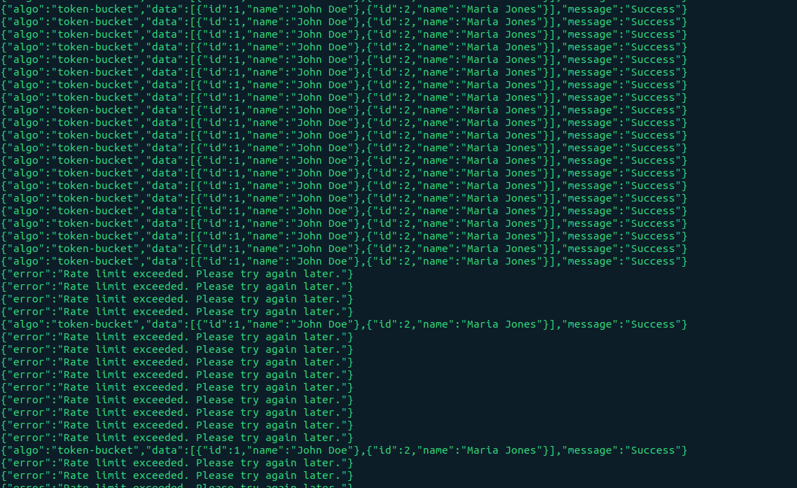
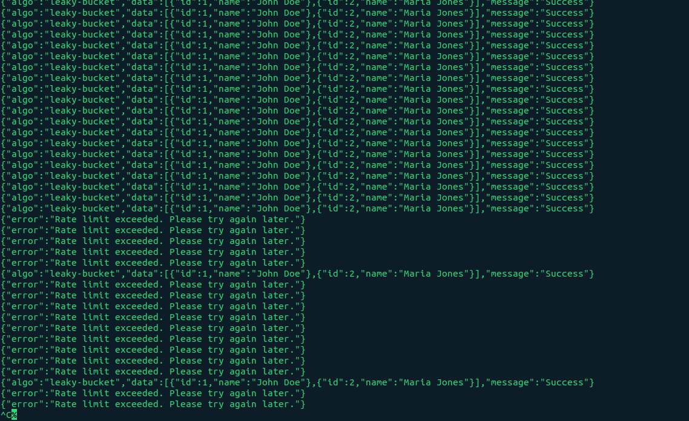
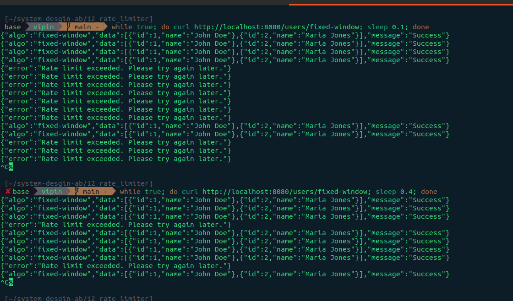
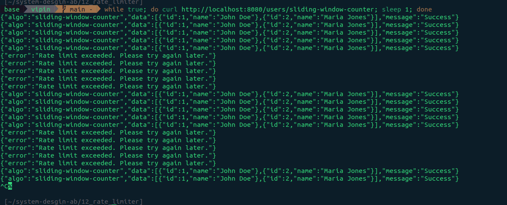

# Rate Limiter

In system design, a **rate limiter** is a tool used to control the amount of incoming or outgoing traffic to a network or service. It acts as a defensive shield that limits the number of requests a user or client can make within a specific timeframe (e.g., "5 requests per second").

If a user exceeds the defined limit, the rate limiter blocks the additional requests, often returning an **HTTP 429 (Too Many Requests)** status code.

## Why Use a Rate Limiter?

- **Prevent DoS Attacks**: It stops malicious actors from overwhelming your servers with a flood of requests (Denial of Service).

- **Cost Control**: If you use third-party APIs that charge per request, a rate limiter ensures you don't exceed your budget.

- **Server Stability**: It prevents "noisy neighbors" (a single user taking up all resources) from slowing down the experience for everyone else.

- **Managing Traffic Spikes**: It helps maintain a consistent service level during unexpected surges in popularity.

## Common Algorithms

There are several ways to implement the logic behind a rate limiter. Here are the most popular ones:

1. **Token Bucket**

   A "bucket" holds a fixed number of tokens. Each request consumes one token. Tokens are added back to the bucket at a fixed rate. If the bucket is empty, the request is rejected.

   `Pro`: Allows for occasional bursts of traffic.

2. **Leaking Bucket**

   Similar to the token bucket, but requests are processed at a constant, fixed rate (like water leaking from a hole in a bucket).

   `Pro`: Ensures a very stable and smooth flow of requests to the backend.

3. **Fixed Window Counter**

   The timeline is divided into fixed blocks (e.g., 1-minute windows). Each window has a counter.

   `Con`: Can allow double the allowed traffic if many requests happen right at the edge of two windows (the "boundary problem").

4. **Sliding Window Counter**

   A more advanced method that tracks the exact timestamp of each request or uses a rolling window to smooth out the "boundary problem" found in fixed windows.

## Where is it Implemented?

1. **Client-Side**: Unreliable, as users can bypass it by modifying the code.

2. **Server-Side**: Inside the application code (e.g., using a library in Go or Node.js).

3. **API Gateway/Middleware**: The most common approach. Tools like Nginx, Kong, or Amazon API Gateway handle the limiting before the request even reaches your application logic.

## Resources

[Design Rate Limiter](https://bytebytego.com/courses/system-design-interview/design-a-rate-limiter)

<br/>

# Go Code for above algorithms

## 1. Token Bucket:

This repo implemented `Token Bucket` algorithm you can run this command to see in action

- `60 requests/minute with 100 capacity of bucket`

```bash
while true; do curl http://localhost:8080/users/token-bucket; sleep 0.1; done
```



## 2. Leaky Bucket

This repo implemented `Leaky Bucket` algorithm you can run this command to see in action

- `60 requests/minute with 100 capacity of bucket with 1 request/second leak rate`

```bash
while true; do curl http://localhost:8080/users/leaky-bucket; sleep 0.1; done
```



## 3. Fixed Window

This repo implemented `Fixed Window` algorithm you can run this command to see in action

- `2 requests/seconds`

```bash
while true; do curl http://localhost:8080/users/fixed-window; sleep 0.1; done
```



### Example: 2 requests per second

```go
fw := GetFixedWindow(2, time.Second)

**What happens:**

1. `time.Now().UnixNano()` returns current time in **nanoseconds** since Unix epoch
   - Example: `1738065420000000000` (some large number)

2. `fw.Window` is `time.Second` which equals `1000000000` nanoseconds (1 billion)

3. Division: `1738065420000000000 / 1000000000 = 1738065420`

This gives you the **window number** (which second we are in).

```

### Visual Example:

```go
Time (seconds):     0         1         2         3         4
                    |---------|---------|---------|---------|
Window number:      1738065420 1738065421 1738065422 1738065423 1738065424

Requests at:
- 0.1s → window 1738065420 (count: 1)
- 0.5s → window 1738065420 (count: 2)  ✅ Allowed (2/2)
- 0.9s → window 1738065420 (count: 3)  ❌ BLOCKED (exceeds limit of 2)
- 1.1s → window 1738065421 (count: 1)  ✅ Allowed (new window, resets)
- 1.2s → window 1738065421 (count: 2)  ✅ Allowed
```

### The Map Storage:

```go
Counts: map[int64]int


Stores: `windowNumber → requestCount`

{
  1738065420: 2,  // 2 requests in window 1738065420
  1738065421: 2,  // 2 requests in window 1738065421
  1738065422: 1,  // 1 request in window 1738065422
}
```

## 4. Sliding Window Counter

This repo implemented `Sliding Window Counter` algorithm you can run this command to see in action

- `5 requests/ 10 seconds`

```bash
while true; do curl http://localhost:8080/users/sliding-window-counter; sleep 1; done
```



### Step-by-Step Example

#### Setup: limit = 5 requests per 10 seconds

```go
sw := GetSlidingWindow(5, 10*time.Second)


### Scenario Timeline:

Previous Window         Current Window
|-------------------|-------------------|
0s                 10s                 20s
```

### Example 1: Request at 12s (2s into current window)

#### State:

- `prevCount` = 4 (had 4 requests in previous window 0-10s)

- `currCount` = 1 (had 1 request so far in current window 10-20s)

- `lastWindow` = 10s (current window started at 10s)

- `now` = 12s

#### Calculate weight:

```go
now.Sub(sw.lastWindow) = 12s - 10s = 2s (time elapsed in current window)

weight = (windowSize - elapsed) / windowSize
       = (10s - 2s) / 10s
       = 8s / 10s
       = 0.8
```

#### What does weight = 0.8 mean?

- We're 20% into the current window (2s / 10s)
- So 80% of the previous window still "overlaps" with our sliding window

#### Calculate weighted count:

```go
weightedCount = prevCount * weight + currCount
              = 4 * 0.8 + 1
              = 3.2 + 1
              = 4 (after int conversion)
```

#### Decision:

```go
if weightedCount (4) < limit (5):
    currCount++  // becomes 2
    return true  ✅ ALLOWED
```

### Example 2: Request at 15s (5s into current window)

#### State:

- `prevCount` = 4
- `currCount` = 2 (after previous request)
- `lastWindow` = 10s
- `now` = 15s

#### Calculate weight:

```go
elapsed = 15s - 10s = 5s

weight = (10s - 5s) / 10s
       = 5s / 10s
       = 0.5
```

#### Weighted count:

```go
weightedCount = 4 * 0.5 + 2
              = 2 + 2
              = 4
```

#### Decision:

```go
if weightedCount (4) < limit (5):
    currCount++  // becomes 3
    return true  ✅ ALLOWED
```

### Example 3: Request at 19s (9s into current window)

#### State:

- `prevCount` = 4
- `currCount` = 4
- `lastWindow` = 10s
- `now` = 19s

#### Calculate weight:

```go
elapsed = 19s - 10s = 9s

weight = (10s - 9s) / 10s
       = 1s / 10s
       = 0.1
```

#### Weighted count:

```go
weightedCount = 4 * 0.1 + 4
              = 0.4 + 4
              = 4 (after int conversion)
```

#### Decision:

```go
if weightedCount (4) < limit (5):
    currCount++  // becomes 5
    return true  ✅ ALLOWED
```

### Example 4: Another request at 19.5s

#### State:

- `prevCount` = 4
- `currCount` = 5 (after previous request)
- `lastWindow` = 10s
- `now` = 19.5s

#### Calculate weight:

```go
elapsed = 19.5s - 10s = 9.5s

weight = (10s - 9.5s) / 10s
       = 0.5s / 10s
       = 0.05
```

#### Weighted count:

```go
weightedCount = 4 * 0.05 + 5
              = 0.2 + 5
              = 5
```

#### Decision:

```go
if weightedCount (5) < limit (5):  // FALSE! (5 is NOT less than 5)
    return false  ❌ BLOCKED
```

### Example 5: Request at 21s (NEW WINDOW!)

#### State before request:

- `prevCount` = 4
- `currCount` = 5
- `lastWindow` = 10s
- `now` = 21s

#### Window transition check:

```go
now.Sub(sw.lastWindow) = 21s - 10s = 11s

if 11s >= windowSize (10s):  // TRUE!
    sw.prevCount = sw.currCount  // prevCount = 5
    sw.currCount = 0              // currCount = 0
    sw.lastWindow = 21s           // new window starts at 21s
```

#### Calculate weight:

```go
elapsed = 21s - 21s = 0s

weight = (10s - 0s) / 10s
       = 1.0
```

#### Weighted count:

```go
weightedCount = 5 * 1.0 + 0
              = 5
```

#### Decision:

```go
if weightedCount (5) < limit (5):  // FALSE!
    return false  ❌ BLOCKED
```
