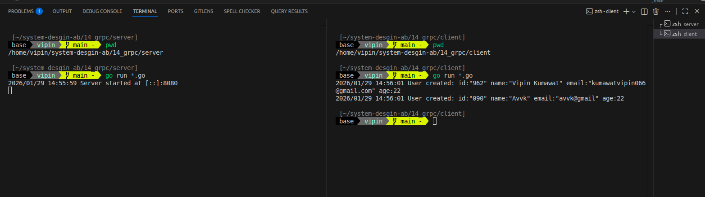
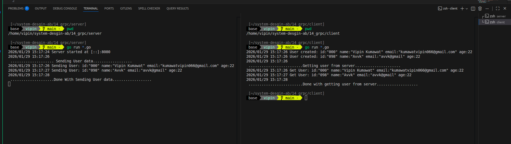
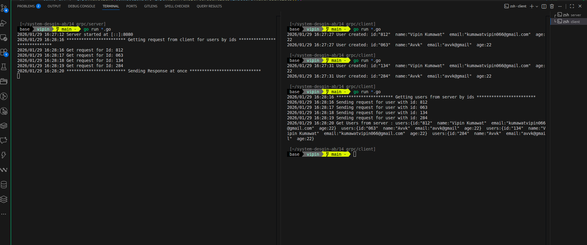

# gRPC

gRPC (gRPC Remote Procedure Call) is a modern, high-performance framework that allows applications to communicate with each other as if they were local functions. It’s built on top of **HTTP/2** and uses **Protocol Buffers** (Protobuf) as its interface definition language.

Think of it as a way to connect services in a microservices architecture with much less overhead than traditional REST APIs.

## Core Components

To understand gRPC, you have to look at its two primary pillars:

### 1. **Protocol Buffers (Protobuf)**

Instead of using JSON or XML, which are text-based and bulky, gRPC uses Protobuf. This is a binary format, meaning it's much smaller and faster to serialize/deserialize. You define your data structures and service methods in a `.proto` file:

```protobuf
message UserRequest {
string user_id = 1;
}

service UserService {
rpc GetUser(UserRequest) returns (UserResponse);
}
```

### 2. **HTTP/2 Transport**

gRPC leverages HTTP/2, which provides several performance benefits over HTTP/1.1:

- **Binary Framing**: More efficient parsing.

- **Multiplexing**: Sending multiple requests over a single connection simultaneously.

- **Header Compression**: Reducing the size of request/response headers.

- **Server Push**: Allowing the server to send data before it’s requested.

## gRPC vs. REST

While REST is the industry standard, gRPC excels in specific environments, particularly internal microservices.

| Feature         | gRPC                          | REST                       |
| --------------- | ----------------------------- | -------------------------- |
| **Payload**     | Binary (Protobuf)             | Text (JSON/XML)            |
| **Contract**    | Strict (`.proto` file)        | Optional (OpenAPI/Swagger) |
| **Streaming**   | Bidirectional, Client, Server | Mostly Request-Response    |
| Browser Support | Limited (needs gRPC-Web)      | Native                     |

## Types of gRPC Methods

1. **Unary**: The classic request-response. The client sends one request and gets one response.

2. **Server Streaming**: The client sends one request, and the server returns a stream of messages (e.g., a live news feed).

3. **Client Streaming**: The client sends a stream of messages, and the server responds with a single message (e.g., uploading a large file).

4. **Bidirectional Streaming**: Both client and server send a stream of messages simultaneously (e.g., a chat application).

## Why Use It?

- **Speed**: Binary serialization and HTTP/2 make it significantly faster than REST.

- **Type Safety**: Code generation ensures that both the client and server adhere to the same contract, reducing "undefined" errors.

- **Polyglot**: You can generate client/server code in almost any language (Go, Python, Java, C++, etc.) from the same `.proto` file.

<br/>
<br/>

# Golang + Protoc + gRPC

This repo covers all the 4 types of `gRPC` methods in golang with `protoc` as docker container.

## Docker

Up the container

```bash
docker compose up -d
```

Container status

```bash
docker ps
```

### Create golang proto and gRPC code

```bash
docker exec -it proto-gen protoc --go_out=. --go_opt=paths=source_relative --go-grpc_out=. --go-grpc_opt=paths=source_relative proto/user.proto
```

## gRPC Methods

### Unary



### Server Streaming



### Client Streaming



### Bi-Directional Streaming


