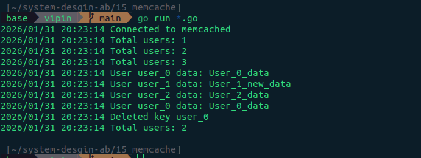

# Memcached

## What is Memcached?

**Memcached** is a high-performance, open-source, **distributed memory object caching system**. Think of it as a giant, high-speed "scratchpad" for your servers. It is designed to speed up dynamic web applications by alleviating database load.

By storing data in **RAM** (Random Access Memory) instead of on a slower disk-based database, Memcached allows for near-instantaneous data retrieval.

## How It Works: Key-Value Storage

Memcached operates on a simple **key-value** model.

1. **Key**: A unique identifier (like a filename or a user ID).

2. **Value**: The data associated with that key (like a chunk of HTML, a database query result, or a user session).

### When an application needs data, it follows this logic:

- **Check Memcached**: "Do you have the data for 'user_123'?"

- **Cache Hit**: If yes, the data is returned immediately.

- **Cache Miss**: If no, the application fetches the data from the database, sends a copy to Memcached for next time, and then returns it to the user.

## Key Technical Characteristics

- **In-Memory Only**: Data is stored entirely in RAM. This makes it incredibly fast, but it also means the data is volatile; if the server restarts, the cache is wiped clean.

- **Distributed Architecture**: You can run Memcached across a cluster of multiple servers. The client library knows how to spread the keys across the different nodes, making it easily scalable.

- **Multithreaded**: Unlike some other caching solutions, Memcached can utilize multiple cores on a single machine, allowing it to handle massive amounts of concurrent requests.

- **LRU (Least Recently Used) Eviction**: When the allocated memory is full, Memcached automatically deletes the oldest, least-used data to make room for new items.

## Common Use Cases

1. **Database Caching**: Storing the results of complex SQL queries so the database doesn't have to re-run them.

2. **Session Store**: Storing user login sessions to keep them active across different web servers.

3. **API Rate Limiting**: Quickly tracking how many requests a user has made in the last minute.
4. **Page Fragment Caching**: Storing parts of a webpage (like a navigation menu or a footer) that don't change often.

## Memcached vs. Redis

While both are popular in-memory stores, they have distinct differences:

1. **Simplicity**: Memcached is dead simple. It stores strings and small blobs. Redis supports complex data structures like lists, sets, and hashes.

2. **Persistence**: Memcached is RAM-only. Redis can save data to disk, allowing it to act more like a primary database.

3. **Scaling**: Memcached scales horizontally (adding more nodes) very easily for simple caching. Redis offers more complex features like Pub/Sub and built-in replication.

## Methods

In Memcached, methods are generally split into **Storage**, **Retrieval**, and **Atomic/Maintenance** commands.

## 1. Storage Methods

These methods allow you to put data into the cache. Each has a specific "overwrite" rule.

| **Method**       | **Description**                                                                                               |
| ---------------- | ------------------------------------------------------------------------------------------------------------- |
| `Set`            | The "all-purpose" command. Stores data, overwriting any existing value for that key.                          |
| `Add`            | Stores data only if the key does not already exist. Fails if it does.                                         |
| `Replace`        | Stores data only if the key already exists. Fails if it doesn't.                                              |
| `Append`         | Adds data to the end of an existing value.                                                                    |
| `Prepend`        | Adds data to the **beginning** of an existing value.                                                          |
| `CompareAndSwap` | Stores data only if it hasn't been modified since you last read it. Essential for preventing race conditions. |

## 2. Retrieval Methods

Used to get data out of the cache.

| **Method**    | **Description**                                                                            |
| ------------- | ------------------------------------------------------------------------------------------ |
| `Get`         | Fetches the value for a single key.                                                        |
| `GetMulti`    | Fetches values for **multiple keys** in a single batch (highly efficient for performance). |
| `GetAndTouch` | Gets the value and **updates its expiration** time at once (prevents it from expiring).    |

## 3. Atomic & Maintenance Methods

These are high-performance operations that don't require you to "Get" the value first.
| **Method** | **Description** |
| ------------- | ------------------------------------------------------------------------------------------ |
| `Increment` | Atomically increases a numeric value stored as a string (e.g., `counter: 1` becomes `2`). |
| `Decrement` | Atomically decreases a numeric value (stops at 0, no negative numbers). |
| `Delete` | Removes an item from the cache. |
| `Touch` | Updates the expiration time of an existing key without retrieving its value. |
| `FlushAll` |Invalidates **every** item in the entire cache (use with caution!). |
| `Ping` | Checks if the Memcached server is alive and reachable. |

<br/>
<br/>

# Golang + Memcache + GoMemcache

This repo contains the simple memcache code with `gomemcache` library

## Docker

Docker image of `memcache`

### Up container of `Memcache`

```bash
docker compose up -d
```

### Container Status

```bash
docker ps
```

## Run the Code

```go
go run *.go
```

### Result

```bash
2026/01/31 20:23:14 Connected to memcached
2026/01/31 20:23:14 Total users: 1
2026/01/31 20:23:14 Total users: 2
2026/01/31 20:23:14 Total users: 3
2026/01/31 20:23:14 User user_0 data: User_0_data
2026/01/31 20:23:14 User user_1 data: User_1_new_data
2026/01/31 20:23:14 User user_2 data: User_2_data
2026/01/31 20:23:14 User user_0 data: User_0_data
2026/01/31 20:23:14 Deleted key user_0
2026/01/31 20:23:14 Total users: 2

```


