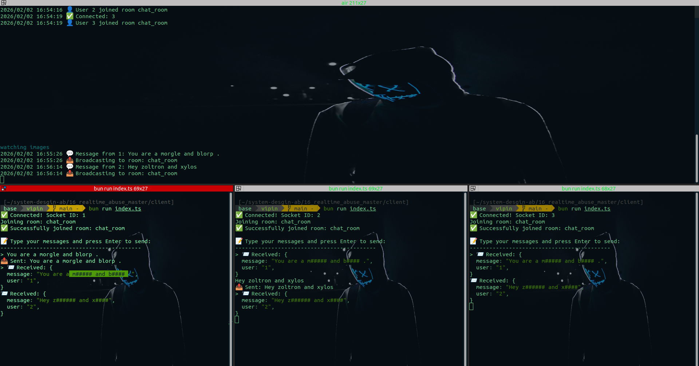

# Abuse Word Detection: Algorithm Comparison

A high-performance profanity filter and bad-word detector implemented in Go using a **Trie (Prefix Tree)** data structure. This implementation uses an optimized two-pointer streaming approach to censor words in $O(n)$ time complexity.

## Problem Statement

We need to check if a word exists in a list of abuse words efficiently.

## 📌 Features

- **Fast Lookups:** Uses a Trie for $O(m)$ word validation (where $m$ is the word length).
- **O(n) Sentence Scanning:** Efficiently scans entire sentences in a single pass using a sliding pointer technique.
- **Case Insensitive:** Automatically handles uppercase and lowercase variations.
- **Memory Efficient:** Uses `strings.Builder` and `runes` to minimize memory allocations and support Unicode/Emojis.
- **Smart Censoring:** Automatically keeps the first letter of a flagged word and replaces the rest with `####` (e.g., `badword` -> `b######`).

---

## ❌ Solution 1: Linear Search (Naive Approach)

### Code:

```go
func isAbuseWord(word string, abuseWords []string) bool {
    for _, abuseWord := range abuseWords {
        if word == abuseWord {
            return true
        }
    }
    return false
}
```

### Time Complexity:

- **Per word check:** O(m \* k)
  - m = number of abuse words in list
  - k = avg length of abuse word for string compare `(word == abuseWord)`
  - Must iterate through entire list in worst case

- **For entire message:** O(n × (m \* k))
  - n = message length
  - m = abuse words count
  - k = avg length of abuse word

### ⚠️ Problems:

- **Slow:** Must check every abuse word for each input word
- **Gets worse** as abuse word list grows
- If list has 10,000 abuse words → 10,000 \* k (avg word length) comparisons per word!

### When to Use:

- ✅ Very small abuse word list (< 10 words)
- ✅ One-time check, not frequent
- ❌ Production systems with large lists

---

## ✅ Solution 2: Hash Map (Good Approach)

### Code:

```go
// One-time setup
func buildHashMap(abuseWords []string) map[string]bool {
    hashMap := make(map[string]bool)
    for _, word := range abuseWords {
        hashMap[word] = true
    }
    return hashMap
}

// Fast lookup
func isAbuseWord(word string, hashMap map[string]bool) bool {
    return hashMap[word]  // O(1) average case
}
```

### Time Complexity:

#### Setup (One-time):

- **Building hash map:** O(m)
  - m = number of abuse words
  - Done once at startup

#### Per Query:

- **Per word check:** O(1) average case
  - Hash lookup is constant time
  - String comparison is O(1) for hash match

- **For entire message:** O(n)
  - n = message length
  - Each word lookup is O(1)

### Space Complexity:

- O(m) for storing hash map
- Trade memory for speed

### ✅ Advantages:

- **Fast:** O(1) lookup per word
- **Scalable:** Works well with 10,000+ abuse words
- **Simple:** Easy to implement and maintain

### ⚠️ Limitations:

- Exact match only (no partial matching)
- Cannot detect variations like "b@d", "ba d", "baaad"
- Uses extra memory

### When to Use:

- ✅ Large abuse word lists (100+ words)
- ✅ Frequent checks
- ✅ Exact word matching is sufficient
- ✅ Production systems

---

## 🌟 Solution 3: Trie (Advanced Approach)

### Code:

```go
type TrieNode struct {
    children map[rune]*TrieNode
    isEnd    bool
}

type Trie struct {
    root *TrieNode
}

// One-time setup
func buildTrie(abuseWords []string) *Trie {
    trie := &Trie{root: &TrieNode{children: make(map[rune]*TrieNode)}}

    for _, word := range abuseWords {
        node := trie.root
        for _, ch := range word {
            if _, exists := node.children[ch]; !exists {
                node.children[ch] = &TrieNode{children: make(map[rune]*TrieNode)}
            }
            node = node.children[ch]
        }
        node.isEnd = true
    }

    return trie
}

// Lookup
func isAbuseWord(word string, trie *Trie) bool {
    node := trie.root

    for _, ch := range word {
        if _, exists := node.children[ch]; !exists {
            return false
        }
        node = node.children[ch]
    }

    return node.isEnd
}
```

### Time Complexity:

#### Setup (One-time):

- **Building trie:** O(m × l)
  - m = number of abuse words
  - l = average word length

#### Per Query:

- **Per word check:** O(w)
  - w = length of word being checked
  - Must traverse character by character

- **For entire message:** O(n) + O(k \* w) ≈ O(n)
  - n = message length
  - k = Number of words
  - w = avg length of word
    - Each character is visited once during extraction
    - Each character is `may` checked once in trie
    - Total: 2n operations = O(n)

### Space Complexity:

- O(m × l) in worst case
- Can be optimized with common prefixes
- More memory than hash map if no common prefixes

### ✅ Advantages:

- **Prefix matching:** Can detect words as you type
- **Space efficient:** Shares common prefixes (e.g., "bad", "badass" share "bad")
- **Pattern matching:** Can implement fuzzy matching
- **Sorted output:** Can retrieve words in order

### Example Use Cases:

```go
// 1. Prefix detection
"b" → not abuse yet
"ba" → not abuse yet
"bad" → ABUSE DETECTED!

// 2. Common prefix optimization
Words: ["test", "testing", "tester", "tested"]
Trie: root → t → e → s → t (shared!)
                        ├→ (end)
                        ├→ i → n → g (end)
                        ├→ e → r (end)
                        └→ e → d (end)
```

### When to Use:

- ✅ Need prefix matching
- ✅ Autocomplete features
- ✅ Pattern/fuzzy matching
- ✅ Many words with common prefixes
- ❌ Simple exact matching (hash map is simpler)

---

<br/>

# Real-Time Chat with Socket.IO & Go

A real-time chat application demonstrating Socket.IO integration with Go (Echo framework) and Bun.js client, featuring room-based messaging and profanity filtering.

---

## 🎯 Project Overview

This project implements a **real-time chat system** where multiple clients can:

- Connect to a Socket.IO server built with Go
- Join specific chat rooms
- Send and receive messages in real-time
- Automatic profanity filtering with censorship

---

## 🏗️ Architecture

```
┌─────────────────┐         WebSocket/Polling        ┌──────────────────┐
│                 │ ◄─────────────────────────────► │                  │
│  Bun.js Client │         Socket.IO v2             │   Go Server      │
│  (Terminal)     │                                  │   (Echo + S.IO)  │
│                 │                                  │                  │
└─────────────────┘                                  └──────────────────┘
        │                                                     │
        │                                                     │
        └──────────────► Join Room: "chat_room" ◄────────────┘
                                    │
                    ┌───────────────┼───────────────┐
                    │               │               │
                Client 1        Client 2        Client 3
                    │               │               │
                    └───────► Broadcast Messages ◄──┘
```

---

## 🚀 Features

### Server (Go)

- ✅ **Socket.IO v2 Protocol** compatibility
- ✅ **Echo Framework** for HTTP routing
- ✅ **Room-based messaging** (multiple rooms support)
- ✅ **Real-time broadcasting** to all room members
- ✅ **Profanity filter** (Trie-based abuse word detection)
- ✅ **Connection management** (connect/disconnect events)
- ✅ **Error handling** and logging

### Client (Bun.js)

- ✅ **Interactive CLI** for sending messages
- ✅ **Auto-join room** on connection
- ✅ **Real-time message display**
- ✅ **Graceful disconnect** (type `exit` or `quit`)
- ✅ **Emoji indicators** for better UX

---

## 📂 Project Structure

```
.
├── server/
│   ├── main.go                 # Go Socket.IO server with Echo
│   ├── algo                    # Trie-based profanity detection
│   └── go.mod
│
├── client/
│   ├── index.ts                # Bun.js Socket.IO client
│   └── package.json            # Dependencies (socket.io-client v2.5.0)
│
└── README.md
```

---

## 🔧 Technology Stack

### Backend (Server)

| Technology                 | Purpose                       |
| -------------------------- | ----------------------------- |
| **Go 1.21+**               | Server language               |
| **Echo v4**                | Web framework                 |
| **googollee/go-socket.io** | Socket.IO v2 implementation   |
| **Trie Data Structure**    | Efficient profanity detection |

### Frontend (Client)

| Technology                  | Purpose                          |
| --------------------------- | -------------------------------- |
| **Bun.js**                  | Runtime environment              |
| **socket.io-client v2.5.0** | Socket.IO client (v2 compatible) |
| **readline**                | Interactive CLI                  |

---

## Abuse Words

This repo simulate some bad words in `abuse_words.txt`
<br/>

## 📡 Socket.IO Events

### Server Events

| Event        | Direction       | Description          | Payload                      |
| ------------ | --------------- | -------------------- | ---------------------------- |
| `connect`    | Server → Client | User connected       | `socket.id`                  |
| `disconnect` | Server → Client | User disconnected    | `reason`                     |
| `join`       | Client → Server | Join a room          | `room: string`               |
| `joined`     | Server → Client | Confirmation of join | `room: string`               |
| `chat`       | Client → Server | Send message         | `message: string`            |
| `message`    | Server → Client | Receive message      | `message: string` (censored) |
| `error`      | Server → Client | Error occurred       | `error: string`              |

### Event Flow

```
Client                          Server                          Other Clients
  │                               │                                    │
  ├─── connect ──────────────────►│                                    │
  │◄──────────────── connected ───┤                                    │
  │                               │                                    │
  ├─── emit("join", "chat_room") ►│                                    │
  │◄─── emit("joined", "chat_room")┤                                   │
  │                               │                                    │
  ├─── emit("chat", "Hello!") ───►│                                    │
  │                               ├─ Filter abuse words                │
  │                               ├─ BroadcastToRoom("message") ──────►│
  │◄─────── emit("message") ──────┤                                    │
  │                               │◄───────── emit("message") ─────────┤
  │                               │                                    │
```

---

## 🛠️ Installation & Setup

### Prerequisites

- Go 1.21+
- Bun.js 16+
- npm or yarn

### 1. Server Setup (Go)

```bash
# Navigate to server directory
cd server

# Install Go dependencies
go mod download

# Run the server
go run *.go
```

Server will start on `http://localhost:8080`

### 2. Client Setup (Bun.js)

```bash
# Navigate to client directory
cd client

# Install dependencies (IMPORTANT: Use v2.5.0 for compatibility)
bun install

# Run the client
bun run index.ts
```

---

## 🎮 Usage

### Starting the Server

```bash
go run *.go
```

**Expected Output:**

```
🚀 Server starting on :8080
⇨ http server started on [::]:8080
```

### Connecting Clients

**Terminal 1:**

```bash
bun run index.ts
```

**Output:**

```
✅ Connected! Socket ID: abc123
Joining room: chat_room
✅ Successfully joined room: chat_room

📝 Type your messages and press Enter to send:
-------------------------------------------
>
```

**Terminal 2 (another client):**

```bash
bun run index.ts
```

### Sending Messages

**Client 1:**

```
> Hello everyone!
📤 Sent: Hello everyone!
```

**Client 2 receives:**

```
📨 Received: Hello everyone!
```

### Profanity Filtering

**Client 1:**

```
> You are a morgle and blorp
📤 Sent: You are a morgle and blorp
```

**All clients receive (censored):**

```
📨 Received: You are a m##### and b####
```

_(Assuming "morgle" and "blorp" are in the abuse word list)_

### Exiting

```
> exit
👋 Goodbye!
❌ Disconnected!
```

---

## 🔐 Profanity Filter Implementation

### How It Works

1. **Trie Data Structure:**
   - Stores abuse words efficiently
   - O(w) lookup time (w = word length)
   - Shared prefix optimization

2. **Message Processing:**

```go
   message := "You are a badword and test"

   // Split into words
   words := ["You", "are", "a", "badword", "and", "test"]

   // Check each word in Trie
   "You" → Not abuse ✓
   "are" → Not abuse ✓
   "badword" → ABUSE! → Censor to "b######"

   // Result
   "You are a b###### and test"
```

3. **Censoring Rule:**
   - First character remains
   - Rest replaced with `#`
   - Example: `shit` → `s###`

---

## 🐛 Troubleshooting

### Issue: "It seems you are trying to reach a Socket.IO server in v2.x with a v3.x client"

**Solution:**

```bash
# Uninstall current client
bun uninstall socket.io-client

# Install v2.5.0 specifically
bun install socket.io-client@2.5.0
```

### Issue: Messages not broadcasting to all clients

**Check:**

1. All clients joined the same room
2. Room name is correct (`"chat_room"` by default)
3. Server logs show "Broadcasting to room"

### Issue: Server crashes on message send

**Solution:**

- Ensure Trie is initialized before server starts
- Check abuse word list isn't empty
- Verify message isn't nil/empty

### Issue: Client keeps polling but never connects

**Solution:**

```javascript
// Add explicit transport in client.js
const socket = io(`http://localhost:${PORT}`, {
  transports: ["websocket", "polling"],
  reconnection: true,
  reconnectionDelay: 1000,
});
```

---

## 🎨 Demo Screenshots

### Server Logs

```
2026/02/02 16:54:16 ✅ User 2 joined room chat_room
2026/02/02 16:54:19 ✅ Connected: 3
2026/02/02 16:54:19 ✅ User 3 joined room chat_room
2026/02/02 16:55:26 💬 Message from 1: You are a morgle and blorp
2026/02/02 16:55:26 📤 Broadcasting to room: chat_room
```

### Client Output (Censored)

```
📨 Received: You are a m##### and b####
```


###



---

## 🔄 Message Flow Example

### Scenario: 3 clients in same room

```
Client 1                    Server                      Client 2 & 3
   │                           │                              │
   ├─ "Hello everyone!" ───────►│                              │
   │                           ├─ Check abuse: ✓ Clean        │
   │                           ├─ Broadcast ──────────────────►│
   │◄────────────────────────── ├─ Echo back                   │
   │                           │                              │
   │                           │                              │
   ├─ "You shit!" ─────────────►│                              │
   │                           ├─ Check abuse: ✗ DETECTED     │
   │                           ├─ Censor: "You s###!"         │
   │                           ├─ Broadcast ──────────────────►│
   │◄─ "You s###!" ────────────┼─ Echo back                   │
   │                           │                              │
```

---

## 🚧 Future Enhancements

- [ ] **User authentication** (login/logout)
- [ ] **Private messaging** (1-on-1 chat)
- [ ] **File sharing** (image/document upload)
- [ ] **Typing indicators** ("User is typing...")
- [ ] **Read receipts** (message seen status)
- [ ] **Message history** (persistent storage)
- [ ] **Web client** (React/Vue UI)
- [ ] **Mobile client** (React Native)
- [ ] **AI moderation** (advanced content filtering)
- [ ] **Rate limiting** (prevent spam)

---

## 📝 API Reference

### Server API

#### Join Room

```javascript
socket.emit("join", roomName);
// Response: socket.on('joined', (room) => {...})
```

#### Send Message

```javascript
socket.emit("chat", message);
// Broadcasts to all in room via 'message' event
```

#### Receive Message

```javascript
socket.on("message", (msg) => {
  console.log("Received:", msg);
});
```

### Client Methods

#### Connect

```javascript
const socket = io("http://localhost:8080");
```

#### Disconnect

```javascript
socket.disconnect();
```

#### Check Connection Status

```javascript
if (socket.connected) {
  console.log("Connected!");
}
```

---

## 🤝 Contributing

Contributions welcome! Please:

1. Fork the repository
2. Create a feature branch (`git checkout -b feature/amazing-feature`)
3. Commit changes (`git commit -m 'Add amazing feature'`)
4. Push to branch (`git push origin feature/amazing-feature`)
5. Open a Pull Request

---

## 📄 License

MIT License - feel free to use this project for learning or production!

---

## 👨‍💻 Author

Built with ❤️ for learning Socket.IO, Go, and real-time systems.

---

## 📚 Resources

- [Socket.IO Documentation](https://socket.io/docs/v4/)
- [Echo Framework Guide](https://echo.labstack.com/guide/)
- [Go Socket.IO Library](https://github.com/googollee/go-socket.io)
- [Trie Data Structure](https://en.wikipedia.org/wiki/Trie)

---

## ⚡ Quick Start (TL;DR)

```bash
# Terminal 1: Start server
cd server && go run *.go

# Terminal 2: Start client 1
cd client && bun run index.ts

# Terminal 3: Start client 2
cd client && bun run index.ts

# Start chatting! 🎉
```
