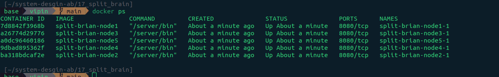
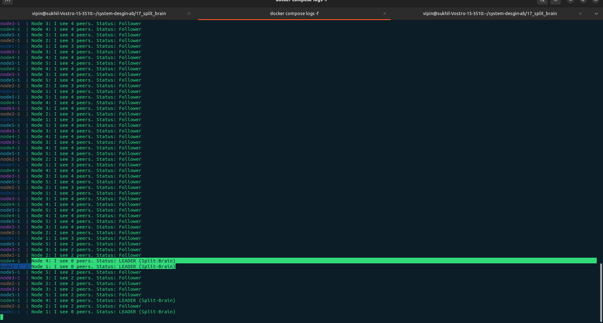

# Split Brain

In system design, **split-brain** is a critical failure state that occurs in distributed systems when a cluster of nodes loses connectivity between its members but the individual nodes remain operational.

Because the nodes can no longer communicate, the cluster "splits" into two or more independent partitions. Each partition incorrectly assumes the other has failed and attempts to take control of the system's operations (like writing to a database or managing a shared resource).

## How It Happens

Imagine a three-node cluster ($Node\ A$, $Node\ B$, $Node\ C$) designed for high availability. One node is the "Leader" and handles all writes.

1. **The Network Partition**: A network glitch cuts the connection between $Node\ A$ and the rest of the cluster ($B$ and $C$).
2. **False Failure Detection**: $Node\ A$ thinks $B$ and $C$ are dead. Simultaneously, $B$ and $C$ think $A$ is dead.
3. **The Conflict**: $B$ and $C$ elect a new leader to keep the service running. However, $A$ still considers itself the leader.
4. **Data Corruption**: You now have two leaders. If both start writing to the same storage or database, they will overwrite each other’s data, leading to massive inconsistency and corruption.

## Consequences of Split-Brain

- **Data Inconsistency**: Different parts of the system have different versions of "the truth."

- **Resource Contention**: Multiple nodes may try to access or lock the same physical hardware or file simultaneously.

- **System Downtime**: In many cases, the only way to recover from a split-brain state is to manually shut down the entire system and perform data reconciliation.

## How to Prevent It

To avoid this "identity crisis," system designers use several strategies:

### 1. **Quorum (Majority Voting)**

This is the most common defense. A partition is only allowed to perform operations if it contains a strict majority of the total nodes (more than $N/2$).In a 3-node cluster, a partition needs 2 nodes to function.If a 1-2 split occurs, the 1-node side shuts itself down because it doesn't have a majority.

### 2. **Fencing (STONITH)**

Fencing is the act of isolating a "rogue" node. A common (and aggressive) method is STONITH (Shoot The Other Node In The Head), where the healthy partition sends a command to power off the suspected failing node via its power management interface.

# Split-Brain Scenario Demonstration

A simple demonstration of the **split-brain problem** in distributed systems using Docker, Go, and network partitioning.

This demo uses a **naive leader election** algorithm (intentionally flawed) to easily reproduce the split-brain condition.

## Architecture

- **5 nodes** running identical Go services
- **Naive leader election**: A node declares itself leader if it can't see any peers
- **Network partitioning** via iptables to simulate network failures
- **Docker Compose** for orchestration

## Prerequisites

- Docker & Docker Compose
- Linux host or Docker Desktop with iptables support

## Quick Start

### 1. Clone and Start the Cluster

```bash
git clone https://github.com/AVVKavvk/System-Design-AB
cd 17_split_brain
docker compose build
docker compose up
```

You should see all nodes reporting as "Follower" initially.

### 2. Observe Normal Operation

In the logs, you'll see:

```
Node 1: I see 4 peers. Status: Follower
Node 2: I see 4 peers. Status: Follower
Node 3: I see 4 peers. Status: Follower
Node 4: I see 4 peers. Status: Follower
Node 5: I see 4 peers. Status: Follower
```



## Creating Split-Brain Scenarios

### Scenario 1: Single Isolated Node

Isolate Node 1 completely:

#### Block incoming to node1

```bash
docker exec split-brian-node1-1 iptables -A INPUT -s 172.20.0.12 -j DROP  # Node 2
docker exec split-brian-node1-1 iptables -A INPUT -s 172.20.0.13 -j DROP  # Node 3
docker exec split-brian-node1-1 iptables -A INPUT -s 172.20.0.14 -j DROP  # Node 4
docker exec split-brian-node1-1 iptables -A INPUT -s 172.20.0.15 -j DROP  # Node 5
```

#### Block outgoing from node1

```bash
docker exec split-brian-node1-1 iptables -A OUTPUT -d 172.20.0.12 -j DROP  # Node 2
docker exec split-brian-node1-1 iptables -A OUTPUT -d 172.20.0.13 -j DROP  # Node 3
docker exec split-brian-node1-1 iptables -A OUTPUT -d 172.20.0.14 -j DROP  # Node 4
docker exec split-brian-node1-1 iptables -A OUTPUT -d 172.20.0.15 -j DROP  # Node 5
```

**Result**: Node 1 becomes a leader in isolation

```
Node 1: I see 0 peers. Status: LEADER (Split-Brain) ⚠️
Node 2: I see 3 peers. Status: Follower
Node 3: I see 3 peers. Status: Follower
Node 4: I see 3 peers. Status: Follower
Node 5: I see 3 peers. Status: Follower
```

### Scenario 2: Multiple Leaders (True Split-Brain)

Isolate both Node 1 and Node 4:

#### Isolate Node 1 (commands above)

#### Isolate Node 4

**Block incoming to node4:**

```bash
docker exec split-brian-node4-1 iptables -A INPUT -s 172.20.0.11 -j DROP  # Node 1
docker exec split-brian-node4-1 iptables -A INPUT -s 172.20.0.12 -j DROP  # Node 2
docker exec split-brian-node4-1 iptables -A INPUT -s 172.20.0.13 -j DROP  # Node 3
docker exec split-brian-node4-1 iptables -A INPUT -s 172.20.0.15 -j DROP  # Node 5
```

**Block outgoing from node4:**

```bash
docker exec split-brian-node4-1 iptables -A OUTPUT -d 172.20.0.11 -j DROP  # Node 1
docker exec split-brian-node4-1 iptables -A OUTPUT -d 172.20.0.12 -j DROP  # Node 2
docker exec split-brian-node4-1 iptables -A OUTPUT -d 172.20.0.13 -j DROP  # Node 3
docker exec split-brian-node4-1 iptables -A OUTPUT -d 172.20.0.15 -j DROP  # Node 5
```

**Result**: **SPLIT-BRAIN** - Multiple leaders exist simultaneously! 🚨

```
Node 1: I see 0 peers. Status: LEADER (Split-Brain) ⚠️
Node 2: I see 2 peers. Status: Follower
Node 3: I see 2 peers. Status: Follower
Node 4: I see 0 peers. Status: LEADER (Split-Brain) ⚠️
Node 5: I see 2 peers. Status: Follower
```



## Restoring Connectivity

To clear all iptables rules and restore normal operation:

```bash
# Reset all nodes
for i in {1..5}; do
    docker exec split-brian-node${i}-1 iptables -F
done
```

After a few seconds, all nodes should return to "Follower" status.

## Monitoring Tips

### Watch logs in real-time:

```bash
docker-compose logs -f | grep "Status:"
```

### Check individual node status:

```bash
docker logs split-brian-node1-1 --tail 5
```

### Monitor script:

```bash
#!/bin/bash
while true; do
    clear
    echo "=== Cluster Status ==="
    date
    echo ""
    for i in {1..5}; do
        echo -n "Node $i: "
        docker logs split-brian-node${i}-1 --tail 1 2>/dev/null | grep "Status:" || echo "no status yet"
    done
    sleep 2
done
```

## Why This Happens

The naive algorithm has a fatal flaw:

```go
if aliveCount == 0 {
    status = "LEADER (Split-Brain)"
} else {
    status = "Follower"
}
```

**Problem**: Each isolated node thinks "I can't see anyone, so I must be the leader!"

## Real-World Solutions

Production systems prevent split-brain using:

1. **Quorum-based consensus** (Raft, Paxos)
   - Require majority votes (e.g., 3 out of 5 nodes)
   - Node 1 alone cannot form a quorum

2. **Fencing mechanisms**
   - STONITH (Shoot The Other Node In The Head)
   - Prevent isolated nodes from taking actions

3. **Witness/Arbitrator nodes**
   - Third-party tie-breakers

4. **Generation numbers/epochs**
   - Track leadership generations to detect stale leaders

## Project Structure

```
.
├── main.go              # Naive distributed service
├── docker-compose.yml   # 5-node cluster definition
├── Dockerfile           # Container image
└── README.md            # This file
```

## Learning Objectives

- Understand split-brain conditions
- See why naive algorithms fail
- Practice network partitioning with iptables
- Appreciate the complexity of distributed consensus

## Cleanup

```bash
docker-compose down
```

## Contributing

Feel free to experiment with different partition scenarios and share your findings!

---

**⚠️ Warning**: This is a **demonstration of what NOT to do**. Never use this naive approach in production systems. Use proven consensus algorithms like Raft or Paxos instead.
