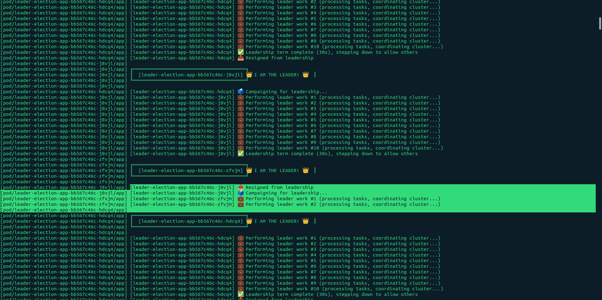

# Leader Election

In distributed systems, **leader election** is the process of designating a single node (server) as the "organizer" or "coordinator" for a specific task or resource. While all nodes in a cluster might be capable of doing the work, having everyone try to do it at once often leads to chaos.

## Why is Leader Election Needed?

In a distributed environment, you often need to ensure **Mutual Exclusion** (only one person does the job) and **Strong Consistency**. Here are the primary reasons why it’s essential:

1. **Avoiding Duplication of Work**

If you have a scheduled task (like generating a daily billing report), you don't want five different servers running that same heavy job simultaneously. A leader ensures the task is executed exactly once.

2. **Maintaining Data Consistency**

   In databases or distributed file systems, having multiple nodes writing to the same data at the same time can lead to "Split Brain" scenarios or data corruption. A leader acts as the "Source of Truth" to sequence writes.

3. **Centralized Coordination**
   Some tasks require a global view of the system, such as:
   - Assigning partitions to consumers in a message queue.

   - Managing cluster metadata.

   - Distributing configuration changes.

## How Does it Work? (The Mechanics)

Leader election usually involves an algorithm where nodes communicate to agree on who is the most "fit" to lead.

### Popular Algorithms

- **Raft**: Highly popular and easier to understand. Nodes are in one of three states: Follower, Candidate, or Leader. If a follower doesn't hear from a leader (heartbeat), it becomes a candidate and asks for votes.

- **Paxos**: The "gold standard" for consensus, though notoriously difficult to implement correctly.

- **Bully Algorithm**: When a node notices the leader is down, it sends an election message to all nodes with a higher ID. If no one responds, it "bullies" its way into leadership.

### Using a Third-Party Coordinator

Many modern systems don't write their own election logic. Instead, they use a "lock" mechanism in a distributed coordination service:

- **Zookeeper**: Nodes try to create an "ephemeral" node. Whoever creates it first is the leader. If that node disappears (the server crashes), Zookeeper notifies the others to try again.

- **Etcd**: Similar to Zookeeper, used heavily by Kubernetes for its own leader election (e.g., for the kube-controller-manager).

## The Trade-offs

While leader election simplifies coordination, it introduces two major risks:

1. **Single Point of Failure**: If the leader dies, the system might be "stalled" until a new leader is elected.
2. **Split Brain**: If a network partition occurs, two different groups of nodes might both think they have elected a leader. This is usually solved by requiring a Quorum (a majority of nodes, $N/2 + 1$) to agree on a leader. [link](https://github.com/AVVKavvk/System-Design-AB/tree/main/17_split_brain)

<br/>
<br/>

# Real Life Problem example

## The Problem: The "Double Dialer" Disaster

Imagine you have a `Telephony Service` written in Go. To handle 10,000 calls, you run `5 instances` of your service for high availability.

You have a feature: "At 9:00 AM, call all customers to remind them of their appointment."

- **The Bug**: At 9:00 AM, the "Cron Job" or "Timer" inside **all 5 instances** triggers.

- **The Result**: Your customers receive **5 identical phone calls** at the same time. This looks unprofessional, wastes money on API credits, and might get your number flagged as spam.

### Why standard tools fail:

- **Local Variables**: Each instance has its own memory; they can't talk to each other.

- **Postgres**: You could try a SELECT FOR UPDATE lock, but if the instance holding the lock crashes, the lock might hang, and no calls get made at all.

## The Solution: etcd Distributed Locking

We use etcd to ensure that **exactly one** instance becomes the "Manager" who triggers the calls.

### How etcd Solves It (Step-by-Step)

1. **The Campaign**: All 5 Go instances say to etcd: "I want to be the 'Dialer-Boss'."

2. **The Atomic Winner**: etcd uses its Raft algorithm to pick exactly one winner. It guarantees there can never be two.

3. **The Lease (The Heartbeat)**: The winner gets a Lease. As long as the Go instance is healthy, it sends a "heartbeat" to etcd to keep that lease.

4. **The Work**: The winner triggers the calls. The other 4 instances sit quietly, watching etcd.

5. **The Failover**: If the "Boss" instance's server catches fire, the heartbeat stops. etcd waits a few seconds, deletes the "Boss" key, and immediately notifies one of the other 4 instances: "Hey, the old Boss is dead. You are the new Boss. Take over!"

  <br/>
  <br/>

# Leader Election Demo with Kubernetes (Minikube) and etcd

This guide shows how to run a real-time leader election demo with multiple nodes (pods) in Kubernetes using Minikube.

## Overview

This code implements a distributed leader election system where multiple instances (nodes/pods) compete to become "the leader." Only ONE instance is the leader at any time, while others wait their turn.

### Main Function - Connection Setup

```go
etcdEndpoint := os.Getenv("ETCD_ENDPOINT")
if etcdEndpoint == "" {
    etcdEndpoint = "localhost:2379"
}
```

- Gets the etcd server address from environment variable
- Falls back to localhost:2379 if not set

```go
podName := os.Getenv("POD_NAME")
if podName == "" {
    hostname, _ := os.Hostname()
    podName = hostname
}
```

- Gets a unique identifier for this node (from K8s pod name or hostname)
- This is used to identify which node is the leader

```go
// Retry connection to etcd
for i := 0; i < 10; i++ {
    cli, err = clientv3.New(clientv3.Config{
        Endpoints:   []string{etcdEndpoint},
        DialTimeout: 5 * time.Second,
    })
    if err == nil {
        break
    }
    // Retry logic...
}
```

- Tries to connect to etcd up to 10 times
- Important for Kubernetes where etcd might not be ready immediately
- Once connected, enters an infinite loop for continuous leader election

### runLeaderElection - The Core Logic

#### 1. Create a Session (Lease)

```go
session, err := concurrency.NewSession(cli, concurrency.WithTTL(10))
```

#### This is CRUCIAL for automatic failover!

- Creates a session with a 10-second TTL (Time-To-Live)
- Think of it as a "heartbeat lease"
- etcd keeps this session alive as long as the node is healthy
- **If the node crashes or loses network connection,** the lease expires after 10 seconds
- When the lease expires, etcd automatically removes this node from leadership consideration

#### 2. Create Election Object

```go
election := concurrency.NewElection(session, "/k8s-demo/leader")
```

- All competing nodes use the same key prefix (`/k8s-demo/leader`)
- This is how etcd knows which nodes are competing for the same leadership
- Different services would use different prefixes (e.g., `/my-app/leader`, `/worker-pool/leader`)

#### 3. Campaign for Leadership

```go
if err := election.Campaign(ctx, nodeID); err != nil {
    log.Printf("[%s] Campaign failed: %v\n", nodeID, err)
    return
}
```

#### This is where the magic happens!

- `Campaign()` is a **BLOCKING** call
- If another node is already the leader, this call **waits** until leadership becomes available
- When this call returns (no error), **this node IS the leader**
- Uses distributed consensus (Raft algorithm inside etcd) to ensure only ONE leader

#### 4. Perform Leader Work

```go
performLeaderDuties(ctx, nodeID, session)
```

#### 5. Resign Leadership

```go
election.Resign(ctx)
```

- Gracefully give up leadership
- Allows another waiting node to immediately become leader
- This creates the "rotation"

## Prerequisites

1. **Install Minikube**:

   ```bash
   # macOS
   brew install minikube

   # Linux
   curl -LO https://storage.googleapis.com/minikube/releases/latest/minikube-linux-amd64
   sudo install minikube-linux-amd64 /usr/local/bin/minikube
   ```

2. **Install kubectl**:

   ```bash
   # macOS
   brew install kubectl

   # Linux
   curl -LO "https://dl.k8s.io/release/$(curl -L -s https://dl.k8s.io/release/stable.txt)/bin/linux/amd64/kubectl"
   sudo install -o root -g root -m 0755 kubectl /usr/local/bin/kubectl
   ```

3. **Install Docker** (Minikube uses Docker as the driver)

## Quick Start

### Step 1: Start Minikube

```bash
# Start Minikube with sufficient resources
minikube start --cpus=4 --memory=4096

# Verify it's running
minikube status
```

### Step 2: Deploy etcd

```bash
# Apply etcd StatefulSet
kubectl apply -f k8s/etcd-statefulset.yaml

# Wait for etcd to be ready
kubectl wait --for=condition=ready pod/etcd-0 --timeout=60s

# Verify etcd is running
kubectl get pods
kubectl logs etcd-0
```

### Step 3: Build the Leader Election App

```bash
# Use Minikube's Docker daemon (important!)
eval $(minikube docker-env)

# Build the Docker image
docker build -t leader-election:latest .

# Verify image is built
docker images | grep leader-election
```

### Step 4: Deploy the Leader Election App

```bash
# Deploy 3 replicas that will compete for leadership
kubectl apply -f k8s/deployment.yaml

# Wait for pods to be ready
kubectl wait --for=condition=ready pod -l app=leader-election --timeout=60s

# Check pod status
kubectl get pods -l app=leader-election
```

### Step 5: Watch the Leader Election in Action! 🎉

Open multiple terminal windows to watch different pods:

**Terminal 1 - Watch all pods:**

```bash
kubectl get pods -l app=leader-election -w
```

**Terminal 2 - Watch Pod 1 logs:**

```bash
POD1=$(kubectl get pods -l app=leader-election -o jsonpath='{.items[0].metadata.name}')
kubectl logs -f $POD1
```

**Terminal 3 - Watch Pod 2 logs:**

```bash
POD2=$(kubectl get pods -l app=leader-election -o jsonpath='{.items[1].metadata.name}')
kubectl logs -f $POD2
```

**Terminal 4 - Watch Pod 3 logs:**

```bash
POD3=$(kubectl get pods -l app=leader-election -o jsonpath='{.items[2].metadata.name}')
kubectl logs -f $POD3
```

You should see:

- One pod becomes the leader (shows "👑 I AM THE LEADER!")
- Other pods wait their turn
- Leader performs work every 3 seconds
- After 30 seconds, leader steps down
- Another pod immediately becomes the new leader

### Step 6: Test Failover

**Delete the current leader pod:**

```bash
# Find the current leader from the logs
# Then delete that pod
kubectl delete pod <leader-pod-name>
```

Watch the other terminals - you'll see:

- The deleted pod disappears
- Within seconds, one of the remaining pods becomes the new leader
- Automatic failover in action!



## Alternative: Watch All Logs Together

If you prefer to see all logs in one place:

```bash
# Install stern (better log viewing)
brew install stern

# Watch all pods' logs with color coding
stern leader-election
```

## Scaling the Demo

```bash
# Scale to 5 replicas
kubectl scale deployment leader-election-app --replicas=5

# Scale back to 2
kubectl scale deployment leader-election-app --replicas=2
```

## Troubleshooting

### etcd not ready

```bash
kubectl describe pod etcd-0
kubectl logs etcd-0
```

### Pods crashing

```bash
kubectl describe pod <pod-name>
kubectl logs <pod-name>
```

### Can't connect to etcd

```bash
# Test etcd connection from a test pod
kubectl run -it --rm debug --image=quay.io/coreos/etcd:v3.5.11 --restart=Never -- /bin/sh
# Inside the pod:
etcdctl --endpoints=http://etcd:2379 endpoint health
```

### Image not found

Make sure you're using Minikube's Docker daemon:

```bash
eval $(minikube docker-env)
docker build -t leader-election:latest .
```

## Cleanup

```bash
# Delete all resources
kubectl delete -f k8s/deployment.yaml
kubectl delete -f k8s/etcd-statefulset.yaml

# Or delete everything at once
kubectl delete all --all

# Stop Minikube
minikube stop

# Delete Minikube cluster (if you want to start fresh)
minikube delete
```

## Architecture

```
┌─────────────────────────────────────────────────────┐
│                   Minikube Cluster                  │
│                                                     │
│  ┌──────────┐  ┌──────────┐  ┌──────────┐         │
│  │  Pod 1   │  │  Pod 2   │  │  Pod 3   │         │
│  │ (follower)│  │ (LEADER) │  │ (follower)│        │
│  └─────┬────┘  └─────┬────┘  └─────┬────┘         │
│        │             │             │               │
│        └─────────────┼─────────────┘               │
│                      │                             │
│              ┌───────▼────────┐                    │
│              │  etcd Service  │                    │
│              │   (Port 2379)  │                    │
│              └───────┬────────┘                    │
│                      │                             │
│              ┌───────▼────────┐                    │
│              │  etcd Pod      │                    │
│              │ (StatefulSet)  │                    │
│              └────────────────┘                    │
└─────────────────────────────────────────────────────┘
```

## TL;DR

### Run `setup.sh` for setup every thing

```bash
chmod +x setup.sh
./setup.sh
```

### Run `cleanup.sh` for clean up every thing

```bash
chmod +x cleanup.sh
./cleanup.sh
```

## Real-World Use Cases

This pattern is used in production for:

- **Kubernetes Controllers**: Only one instance handles reconciliation
- **Cron Jobs**: Ensure only one instance runs the job
- **Database Primary Election**: MongoDB, PostgreSQL HA
- **Message Queue Consumers**: Prevent duplicate processing
- **Distributed Locks**: Coordinate access to shared resources
