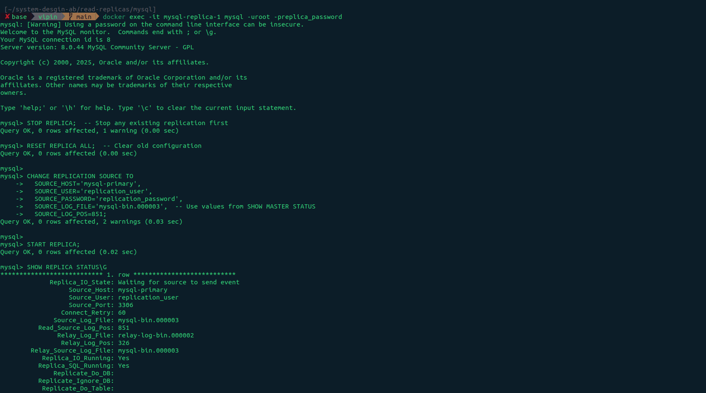

# Architecture Overview

                    ┌──────────────────┐
                    │  mysql-primary   │
                    │    (port 3306)   │
                    │   Read + Write   │
                    └────────┬─────────┘
                             │
           ┌─────────────────┼─────────────────┐
           │                 │                 │
           ▼                 ▼                 ▼
    ┌─────────────┐   ┌─────────────┐   ┌─────────────┐
    │  replica-1  │   │  replica-2  │   │  replica-3  │
    │ (port 3307) │   │ (port 3308) │   │ (port 3309) │
    │  Read Only  │   │  Read Only  │   │  Read Only  │
    └─────────────┘   └─────────────┘   └─────────────┘

# Run

## Step 1 - Docker compose

```docker
docker compose up -d
```

```docker
docker ps
```

## Step 2 - Go inside master node

```docker
docker exec -it mysql-primary mysql -uroot -pprimary_password
```

```mysql
CREATE USER 'replication_user'@'%' IDENTIFIED WITH mysql_native_password BY 'replication_password';
GRANT REPLICATION SLAVE ON *.* TO 'replication_user'@'%';
FLUSH PRIVILEGES;
SHOW MASTER STATUS;
```

Save the `File` and `Position` values!


## Step 3 - Configure Each Replica

### Replica 1:

```docker
docker exec -it mysql-replica-1 mysql -uroot -preplica_password
```

```mysql
STOP REPLICA;  -- Stop any existing replication first
RESET REPLICA ALL;  -- Clear old configuration

CHANGE REPLICATION SOURCE TO
  SOURCE_HOST='mysql-primary',
  SOURCE_USER='replication_user',
  SOURCE_PASSWORD='replication_password',
  SOURCE_LOG_FILE='mysql-bin.000004',  -- Use your values
  SOURCE_LOG_POS=851;                   -- Use your values

START REPLICA;
SHOW REPLICA STATUS\G
```



### Replica 2:

```docker
docker exec -it mysql-replica-2 mysql -uroot -preplica_password
```

```mysql
STOP REPLICA;  -- Stop any existing replication first
RESET REPLICA ALL;  -- Clear old configuration

CHANGE REPLICATION SOURCE TO
  SOURCE_HOST='mysql-primary',
  SOURCE_USER='replication_user',
  SOURCE_PASSWORD='replication_password',
  SOURCE_LOG_FILE='mysql-bin.000004',  -- Same as Replica 1
  SOURCE_LOG_POS=851;                   -- Same as Replica 1

START REPLICA;
SHOW REPLICA STATUS\G
```


### Replica 3:

```docker
docker exec -it mysql-replica-3 mysql -uroot -preplica_password
```

```mysql
STOP REPLICA;  -- Stop any existing replication first
RESET REPLICA ALL;  -- Clear old configuration

CHANGE REPLICATION SOURCE TO
  SOURCE_HOST='mysql-primary',
  SOURCE_USER='replication_user',
  SOURCE_PASSWORD='replication_password',
  SOURCE_LOG_FILE='mysql-bin.000004',  -- Same as Replica 1
  SOURCE_LOG_POS=851;                   -- Same as Replica 1

START REPLICA;
SHOW REPLICA STATUS\G
```


## Step 4 - Test Replication

### On Primary:

```docker
docker exec -it mysql-primary mysql -uroot -pprimary_password
```

```mysql
CREATE DATABASE test_multi_replica;
USE test_multi_replica;
CREATE TABLE products (id INT PRIMARY KEY, name VARCHAR(100));
INSERT INTO products VALUES (1, 'Laptop'), (2, 'Phone'), (3, 'Tablet');
```

### Check on all replicas:

#### Replica 1

```docker
docker exec -it mysql-replica-1 mysql -uroot -preplica_password -e "USE test_multi_replica; SELECT * FROM products;"
```

#### Replica 2

```docker
docker exec -it mysql-replica-2 mysql -uroot -preplica_password -e "USE test_multi_replica; SELECT \* FROM products;"
```

#### Replica 3

```docker
docker exec -it mysql-replica-3 mysql -uroot -preplica_password -e "USE test_multi_replica; SELECT \* FROM products;"
```
