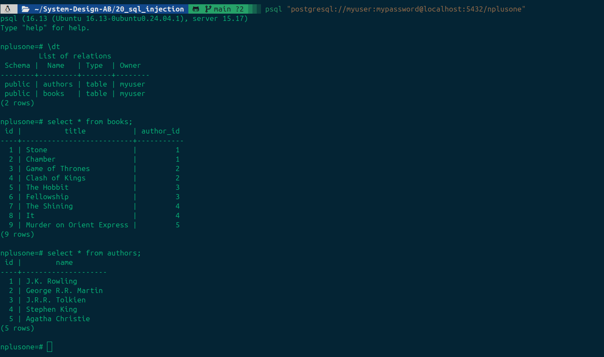
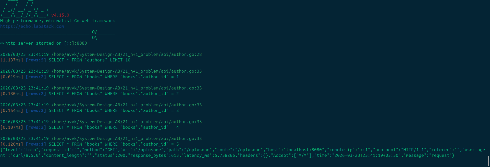
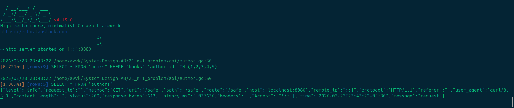

# N + 1 Problem

The **N+1 problem** is a classic performance trap in database management. It happens when your application makes one query to fetch a parent record, and then—unintentionally—executes $N$ additional queries to fetch related data for each child record.

## Understanding the Problem

Imagine you have two tables: `Authors` and `Books`. You want to list 10 authors and the title of one book they wrote.

1. **The "1" Query**: You fetch the list of authors.

   ```sql
   SELECT * FROM authors LIMIT 10;
   ```

2. **The "N" Queries**: Your code loops through those 10 authors. For every single author, it fires a new query to get their books.

   ```sql
   SELECT _ FROM books WHERE author_id = 1;
   ```

   ```sql
   SELECT \_ FROM books WHERE author_id = 2;
   ```

   ...and so on, 10 times.

Instead of one efficient trip to the database, you’ve made 11. On a local machine, this feels fast. In production, with hundreds of records and network latency, it kills performance.

## Comparison: N+1 vs. Eager Loading

| Feature     | N+1 (Lazy Loading)              | Eager Loading (Preload)                         |
| ----------- | ------------------------------- | ----------------------------------------------- |
| DB Queries  | 1 + N                           | Typically 2 (one for parents, one for children) |
| Performance | Slow (High Latency)             | Fast (Minimized Roundtrips)                     |
| Memory      | Low initial usage               | Higher (loads everything at once)               |
| Best For    | When you rarely need child data | When you know you need the full object graph    |

## Images

### DB



### NPlusOne



### Safe


