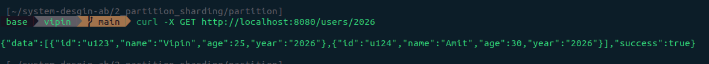

# Go + MySQL Application-Level Partitioning

### This project demonstrates Application-Level Sharding (Partitioning) using Go and MySQL. Instead of a single massive users table, the application dynamically routes data to tables like users_2024, users_2025, and users_2026 and so on based on the user's year.

## Setup & Execution

1. Start the Environment
   Run the Docker Compose file to start the Go application and the MySQL instance.

```docker
docker compose up -d
```

2. Verify Containers: Ensure the MySQL and Go application containers are running.

```docker
docker ps
```

3. Verify Database Connectivity
   Access the MySQL container to confirm connections (initially, the database might be empty until requests are made).

```docker
docker exec -it mysql_partition mysql -uroot -psecret
```


## APIs

### 1. Create Users (Dynamic Partitioning)

#### When a user is created, the application logic checks the year field and creates the corresponding table (e.g., users_2026) if it doesn't exist, then inserts the record.

- Request: Create User 'Vipin' (2026)

```bash
curl -X POST http://localhost:8080/users \
 -H "Content-Type: application/json" \
 -d '{
"id": "u123",
"name": "Vipin",
"age": 25,
"year": "2026"
}'
```

- Request: Create User 'Amit' (2026)

```bash
curl -X POST http://localhost:8080/users \
 -H "Content-Type: application/json" \
 -d '{
"id": "u124",
"name": "Amit",
"age": 30,
"year": "2026"
}'
```

- Request: Create User 'Sneha' (2025)

```bash
curl -X POST http://localhost:8080/users \
 -H "Content-Type: application/json" \
 -d '{
"id": "u125",
"name": "Sneha",
"age": 22,
"year": "2025"
}'
```

- Request: Create User 'Rahul' (2024)

```bash
curl -X POST http://localhost:8080/users \
 -H "Content-Type: application/json" \
 -d '{
"id": "u126",
"name": "Rahul",
"age": 28,
"year": "2024"
}'
```

`Output`: The API confirms the creation of users.

Verify Database Tables: After these requests, you can see that the application automatically created separate tables for each year.


Tables:


## 2. Fetch Active Partitions

### Retrieve a list of all years that currently have partition tables created.

```bash
curl -X GET http://localhost:8080/years \
 -H "Content-Type: application/json"
```

`Output`: Returns the list of years (e.g., 2024, 2025, 2026).


## 3. Get Users by Partition (Year)

### Fetch all users from a specific partition table (e.g., users_2026).

```bash
curl -X GET http://localhost:8080/users/2026
```

`Output`: Returns only Vipin and Amit, as they belong to the 2026 partition.



## 4. Get User by ID (Cross-Partition Search)

### Fetch a specific user by their ID. Since the ID doesn't contain the year, the application searches across active partitions to find the user.

- Request: Find User 'u123' (Vipin)

```bash
curl -X GET http://localhost:8080/users/id/u123
```

- Request: Find User 'u125' (Sneha)

```bash
curl -X GET http://localhost:8080/users/id/u125
```

`Output`: The application successfully locates the users in their respective tables.


