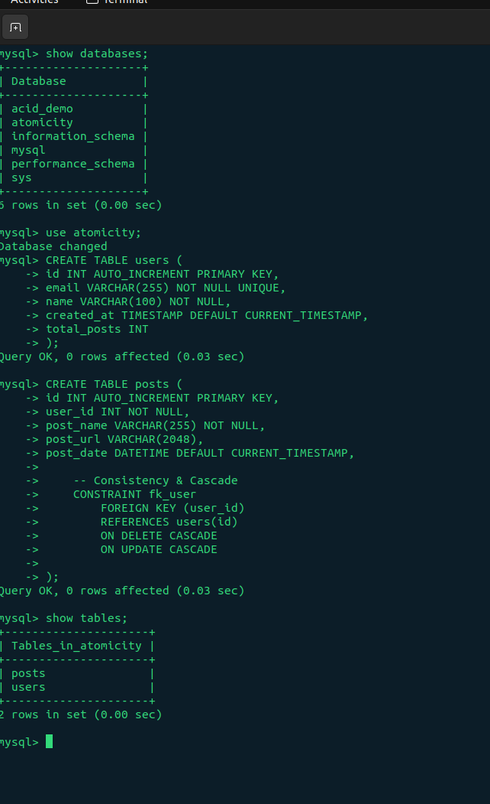
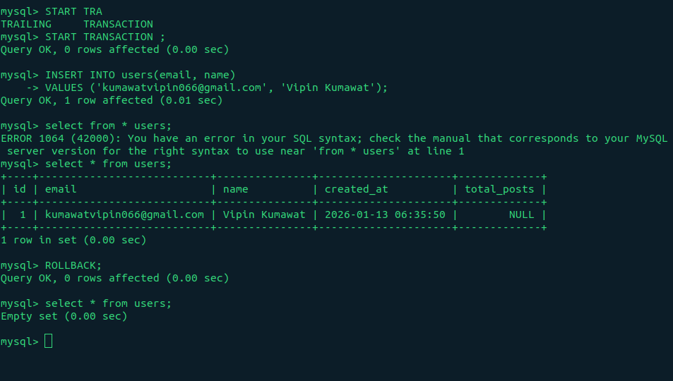
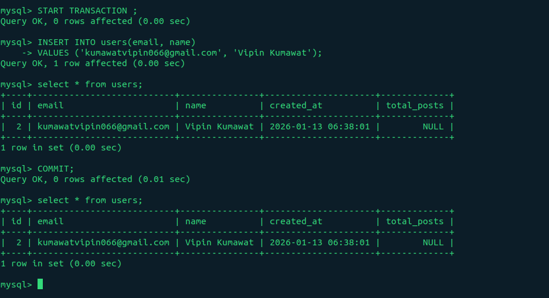
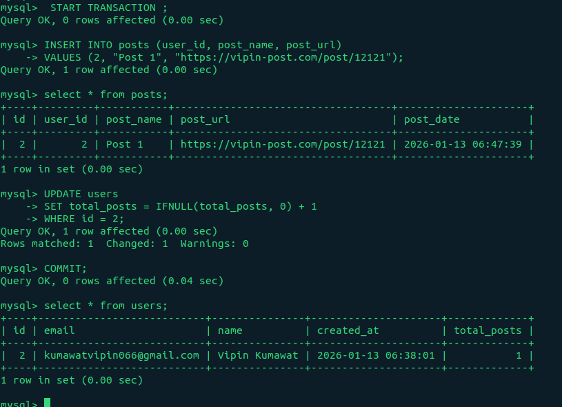

# Database Transactions Example

This repository demonstrates SQL transaction management using MySQL, including ACID properties with a focus on **Atomicity**.

## What is Atomicity?

**Atomicity** is one of the four ACID properties of database transactions. It ensures that a transaction is treated as a single, indivisible unit of work. This means:

- **All operations in a transaction must succeed completely, or none of them should take effect**
- If any operation fails, the entire transaction is rolled back to its initial state
- There are no partial updates - it's "all or nothing"

Think of it like transferring money between bank accounts. If money is deducted from Account A, it must be added to Account B. If the addition fails, the deduction must be reversed - you can't have money disappear into thin air!

### Real-World Example

```sql
-- Transfer $100 from Account A to Account B
START TRANSACTION;
UPDATE accounts SET balance = balance - 100 WHERE id = 'A';
UPDATE accounts SET balance = balance + 100 WHERE id = 'B';
COMMIT;
```

If the second UPDATE fails, the first UPDATE is automatically rolled back, maintaining atomicity.

---

## Database Schema

### Users Table

Stores user information and tracks their total number of posts.

```sql
CREATE TABLE users (
    id INT AUTO_INCREMENT PRIMARY KEY,
    email VARCHAR(255) NOT NULL UNIQUE,
    name VARCHAR(100) NOT NULL,
    created_at TIMESTAMP DEFAULT CURRENT_TIMESTAMP,
    total_posts INT
);
```

### Posts Table

Stores posts created by users with referential integrity.

```sql
CREATE TABLE posts (
    id INT AUTO_INCREMENT PRIMARY KEY,
    user_id INT NOT NULL,
    post_name VARCHAR(255) NOT NULL,
    post_url VARCHAR(2048),
    post_date DATETIME DEFAULT CURRENT_TIMESTAMP,

    -- Ensures data consistency with cascade operations
    CONSTRAINT fk_user
        FOREIGN KEY (user_id)
        REFERENCES users(id)
        ON DELETE CASCADE
        ON UPDATE CASCADE
);
```



**Key Features:**

- Foreign key constraint ensures every post belongs to a valid user
- `ON DELETE CASCADE`: Automatically deletes posts when a user is deleted
- `ON UPDATE CASCADE`: Automatically updates post references when user ID changes

---

## Transaction Examples

### 1. ROLLBACK - Undoing Changes

This example demonstrates how to undo changes when something goes wrong.

```sql
START TRANSACTION;

INSERT INTO users(email, name)
VALUES ('kumawatvipin066@gmail.com', 'Vipin Kumawat');

SELECT * FROM users;

ROLLBACK;  -- Undoes all changes in this transaction
```

**Result:** The user is NOT added to the database. All changes are reverted.



---

### 2. COMMIT - Saving Changes

This example shows how to permanently save changes to the database.

```sql
START TRANSACTION;

INSERT INTO users(email, name)
VALUES ('kumawatvipin066@gmail.com', 'Vipin Kumawat');

SELECT * FROM users;

COMMIT;  -- Permanently saves all changes
```

**Result:** The user IS added to the database permanently.



---

### 3. Atomic Post Creation with Counter Update

This example demonstrates **atomicity** by performing multiple related operations as a single unit.

```sql
START TRANSACTION;

-- Step 1: Create a new post
INSERT INTO posts (user_id, post_name, post_url)
VALUES (2, 'Post 1', 'https://vipin-post.com/post/12121');

SELECT * FROM posts;

-- Step 2: Increment user's total post count
UPDATE users
SET total_posts = IFNULL(total_posts, 0) + 1
WHERE id = 2;

COMMIT;

SELECT * FROM users;
```

**Why This Matters:**

- Both operations succeed together or fail together (atomicity)
- If the post insertion fails, the counter won't be incremented
- If the counter update fails, the post won't be created
- Prevents data inconsistency where `total_posts` doesn't match actual posts

**Note:** `IFNULL(total_posts, 0)` handles the case where `total_posts` might be NULL initially.

## 

## ACID Properties Summary

| Property        | Description                                             |
| --------------- | ------------------------------------------------------- |
| **Atomicity**   | All operations succeed or all fail - no partial updates |
| **Consistency** | Database moves from one valid state to another          |
| **Isolation**   | Concurrent transactions don't interfere with each other |
| **Durability**  | Committed changes survive system failures               |

---

## Best Practices

1. **Keep transactions short** - Hold locks for minimal time
2. **Handle errors properly** - Always include error handling and rollback logic in application code
3. **Use appropriate isolation levels** - Balance consistency needs with performance
4. **Avoid user interaction during transactions** - Don't wait for user input while a transaction is open
5. **Test rollback scenarios** - Ensure your application handles failures gracefully

---

## Running the Examples

1. Create the database and tables using the schema provided
2. Execute each transaction example in sequence
3. Verify results using `SELECT` statements after each transaction
4. Experiment with `ROLLBACK` to see how changes are undone

---
